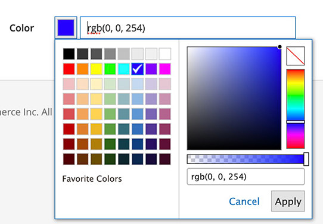

# ColoPicker component

The ColorPicker component uses the [Spectrum](https://bgrins.github.io/spectrum/) and [tinycolor.js](https://bgrins.github.io/TinyColor/) libraries to make it easier to choose and implement color values.
The ColorPicker component must be a child of the [Listing](listing-grid.md) or [Form](form.md) components.

## Options

|Option|Description|Type|Default Value|
|--- |--- |--- |--- |
|`colorFormat`|Defines the color format displayed in the selection tool and input field. Valid formats: `hex`, `rgb`, `hsl`, `hsv`, `name`, `none`|`string`|`-`|
|`colorPickerMode`|Defines the mode that affects the available color picker functionality. Valid modes: `simple`, `full`, `noalpha`, `palette`|`string`|`-`|
|`elementTmpl`|The path to the `.html` template of the particular field type (color-picker).|`string`|`ui/form/element/color-picker`|
|`label`|Option's label.|`string`|`-`|

## Sources files

-  [app/code/Magento/Ui/view/base/ui_component/etc/definition/colorPicker.xsd](https://github.com/magento/magento2/blob/2.4/app/code/Magento/Ui/view/base/ui_component/etc/definition/colorPicker.xsd)
-  [app/code/Magento/Ui/view/base/web/js/form/element/color-picker.js](https://github.com/magento/magento2/blob/2.4/app/code/Magento/Ui/view/base/web/js/form/element/color-picker.js)
-  [app/code/Magento/Ui/view/base/web/js/lib/knockout/bindings/color-picker.js](https://github.com/magento/magento2/blob/2.4/app/code/Magento/Ui/view/base/web/js/lib/knockout/bindings/color-picker.js)
-  [app/code/Magento/Ui/view/base/web/templates/form/element/color-picker.html](https://github.com/magento/magento2/blob/2.4/app/code/Magento/Ui/view/base/web/templates/form/element/color-picker.html)
-  [lib/web/jquery/spectrum/spectrum.js](https://github.com/magento/magento2/blob/2.4/lib/web/jquery/spectrum/spectrum.js)
-  [lib/web/jquery/spectrum/tinycolor.js](https://github.com/magento/magento2/blob/2.4/lib/web/jquery/spectrum/tinycolor.js)

## Examples

```xml
    <form>
    ...
        <colorPicker name="colors_filter" class="Magento\Ui\Component\Form\Element\ColorPicker" component="Magento_Ui/js/form/element/color-picker">
            <settings>
                <label translate="true">Color</label>
                <elementTmpl>ui/form/element/color-picker</elementTmpl>
                <colorFormat>rgb</colorFormat>
                <colorPickerMode>full</colorPickerMode>
                <dataScope>colors_filter</dataScope>
            </settings>
        </colorPicker>
    ...
    </form>
```

## Result


