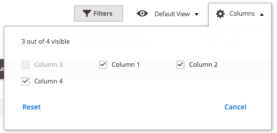

# ColumnsControl component

The ColumnsControls component is a collection of columns. It provides an interface for showing and hiding columns. The interface contains:

*  The total number of all available columns in a grid.
*  The number of columns currently active/displayed.

## Options

| Option | Description | Type | Default Value |
| --- | --- | --- | --- |
| `minVisible` | Minimum number of columns that must be visible. | Number | `1` |
| `maxVisible` | Maximum number of columns that can be visible. | Number | `30` |
| `template` | The path to the component’s `.html` template. | String | `ui/grid/controls/columns` |

## Source files

Extends [`uiCollection`](concepts/collection.md):

*  [`app/code/Magento/Ui/view/base/web/js/grid/controls/columns.js`](https://github.com/magento/magento2/blob/2.4/app/code/Magento/Ui/view/base/web/js/grid/controls/columns.js)
*  [`app/code/Magento/Ui/view/base/web/templates/grid/controls/columns.html`](https://github.com/magento/magento2/blob/2.4/app/code/Magento/Ui/view/base/web/templates/grid/controls/columns.md)

## Example

### Changing attribute values

To change the "minVisible" and "maxVisible" attribute values, override the vendor JS file in a custom module:

`/vendor/magento/module-ui/view/base/web/js/grid/controls/columns.js`

#### Step one: override the javascript file

In `/app/code/[VENDOR_NAME]/[MODULE_NAME]/view/base/requirejs-config.js`, add the following:

```javascript
var config = {
    map: {
        '*': {
            'Magento_Ui/js/grid/controls/columns':'VENDOR_NAME_MODULE_NAME/js/grid/controls/columns'
        }
    }
}
```

#### Step two: set the custom values

In `/app/code/[VENDOR_NAME]/[MODULE_NAME]/view/base/web/js/grid/controls/columns.js`, change the "minVisible" and "maxVisible" values as needed:

```js
return Collection.extend({
        defaults: {
            template: 'ui/grid/controls/columns',
            minVisible: 1,
            maxVisible: 4,
            viewportSize: 18,
            displayArea: 'dataGridActions',
            columnsProvider: 'ns = ${ $.ns }, componentType = columns',
            imports: {
                addColumns: '${ $.columnsProvider }:elems'
            },
            templates: {
                headerMsg: $t('${ $.visible } out of ${ $.total } visible')
            }
        }
    });
```

#### Result


