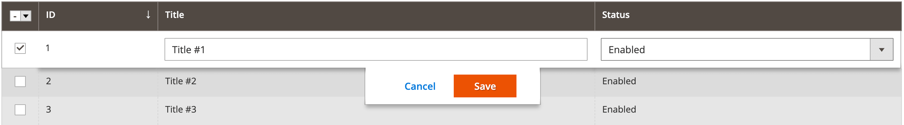

The ColumnsEditorView [UI component](https://glossary.magento.com/ui-component) is an [extension](https://glossary.magento.com/extension) for the [ColumnsEditor](columns-editor.md) component. It provides functionality for showing the inline form for editing a selected grid record.

## Configuration options

| Option | Description | Type | Default Value |
| --- | --- | --- | --- |
| `component` | The path to the component's `.js` file, relative to RequireJS. | String | `Magento_Ui/js/grid/editing/editor-view` |
| `rootSelector` | The CSS selector of a table parent element. | String | `'${ $.columnsProvider }:.admin__data-grid-wrap'` |
| `tableSelector` | The CSS selector of a table element. | String | `'${ $.rootSelector } -> table'` |
| `model` | The [uiRegistry](concepts/registry.md) path to the [ColumnsEditor](columns-editor.md) component. | String | `-` |
| `rowSelector` | The CSS selector of a row element. | String | `'${ $.tableSelector } tbody tr.data-row'` |
| `headerButtonsTmpl` | The Knockout template for showing header buttons. | String | `'<!-- ko template: headerButtonsTmpl --><!-- /ko -->'` |
| `bulkTmpl` | The Knockout template for showing the [ColumnsEditingBulk](columns-editing-bulk.md) component. | String | `<!-- ko scope: bulk --><!-- ko template: getTemplate() --><!-- /ko --><!-- /ko -->` |
| `rowTmpl` | The Knockout template for showing [ColumnsEditorRecord](columns-editor-record.md) component. | String | `<!-- ko with: _editor --><!-- ko if: isActive($row()._rowIndex, true) --><!-- ko with: getRecord($row()._rowIndex, true) --><!-- ko template: rowTmpl --><!-- /ko --><!-- /ko --><!-- ko if: isSingleEditing && singleEditingButtons --><!-- ko template: rowButtonsTmpl --><!-- /ko --><!-- /ko --><!-- /ko --><!-- /ko -->` |

## Sources files

Extends [`uiClass`](concepts/class.md):

-  [app/code/Magento/Ui/view/base/web/js/grid/editing/editor-view.js](https://github.com/magento/magento2/blob/2.4/app/code/Magento/Ui/view/base/web/js/grid/editing/editor-view.js)

## Examples

### Integrate the ColumnsEditorView component with the ColumnsEditor component

This is an example of how the ColumnsEditorView component integrates with the [ColumnsEditor](columns-editor.md) component:

```xml
<listing>
    ...
    <columns name="columns">
        <settings>
            <editorConfig>
                <param name="indexField" xsi:type="string">entity_id</param>
                <param name="enabled" xsi:type="boolean">true</param>
                <param name="selectProvider" xsi:type="string">${ $.columnsProvider }.ids</param>
                <param name="viewConfig" xsi:type="array">
                    <item name="component" xsi:type="string">Magento_Ui/js/grid/editing/record</item>
                    <item name="model" xsi:type="string">${ $.name }</item>
                    <item name="tableSelector" xsi:type="string">${ $.rootSelector } -> table</item>
                </param>
            </editorConfig>
        </settings>
        <selectionsColumn name="ids">
            <settings>
                <indexField>entity_id</indexField>
            </settings>
        </selectionsColumn>
        <column name="entity_id">
            <settings>
                <label translate="true">ID</label>
            </settings>
        </column>
        <column name="title">
            <settings>
                <filter>text</filter>
                <editor>
                    <validation>
                        <rule name="required-entry" xsi:type="boolean">true</rule>
                    </validation>
                    <editorType>text</editorType>
                </editor>
                <label translate="true">Title</label>
            </settings>
        </column>
        <column name="is_active" component="Magento_Ui/js/grid/columns/select">
            <settings>
                <options class="Magento\Config\Model\Config\Source\Yesno"/>
                <filter>select</filter>
                <editor>
                    <editorType>select</editorType>
                </editor>
                <dataType>select</dataType>
                <label translate="true">Status</label>
            </settings>
        </column>
    </columns>
</listing>
```

#### Result


