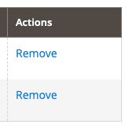

# ActionDelete component

The ActionDelete component provides a user interface for deleting records of the [DynamicRows component](dynamic-rows.md).

## Options

|Option|Description|Type|Default|
|--- |--- |--- |--- |
|`component`|The path to the component's `.js` file in terms of RequireJS.|String|`Magento_Ui/js/dynamic-rows/action-delete`|
|`links`.`value`|Breaks the link established in the `link` property of the parent (abstract) component.|Boolean|`false`|
|`template`|The path to the component's `.html` template.|String|`ui/dynamic-rows/cells/action-delete`|

## Source files

Extends [`Abstract`](https://github.com/magento/magento2/blob/2.4/app/code/Magento/Ui/view/base/web/js/form/element/abstract.js):

-  [`app/code/Magento/Ui/view/base/web/js/dynamic-rows/action-delete.js`](https://github.com/magento/magento2/blob/2.4/app/code/Magento/Ui/view/base/web/js/dynamic-rows/action-delete.js)
-  [`app/code/Magento/Ui/view/base/web/templates/dynamic-rows/cells/action-delete.html`](https://github.com/magento/magento2/blob/2.4/app/code/Magento/Ui/view/base/web/templates/dynamic-rows/cells/action-delete.html)

## Examples

### Integration

This is an example of how ActionDelete component integrates with [DynamicRows](dynamic-rows.md) component:

```xml
<form>
    ...
    <dynamicRows name="dynamic_rows">
            <settings>
                ...
            </settings>
            <container name="record" component="Magento_Ui/js/dynamic-rows/record">
                ...
                <actionDelete template="Magento_Backend/dynamic-rows/cells/action-delete">
                    <argument name="data" xsi:type="array">
                        <item name="config" xsi:type="array">
                            <item name="fit" xsi:type="boolean">false</item>
                        </item>
                    </argument>
                    <settings>
                        <additionalClasses>
                            <class name="some-class">true</class>
                        </additionalClasses>
                        <dataType>text</dataType>
                        <label>Actions</label>
                        <componentType>actionDelete</componentType>
                    </settings>
                </actionDelete>
            </container>
        </dynamicRows>
    ...
</form>
```

#### Result


