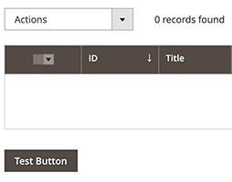

# Button component

The Button component allows user to perform a list of predefined actions by clicking on the corresponding button. Its default display mode is the [HTML](https://glossary.magento.com/html) `<button>` element, which be configured to display a link.

## Options

| Option | Description | Type | Default |
| --- | --- | --- | --- |
| `actions` | A list of actions that are performed when a user clicks on the element. | `ButtonAction[]` | - |
| `additionalClasses` | Sets custom classes to the component's DOM block. | Object | `{}` |
| `buttonClasses` | Sets custom classes to the [HTML](https://glossary.magento.com/html) `<button>` element. | Object | `{}` |
| `class` | The path to the component class. | String | `Magento\Ui\Component\Container` |
| `component` | The path to the component’s JS constructor in terms of RequireJS. | String | `Magento_Ui/js/form/components/button` |
| `disabled` | Initial component's state. When set to `true`, users can't take action on the element. | Boolean | `false` |
| `displayArea` | Display area of the component. | String | `outsideGroup` |
| `displayAsLink` | Show the button as a link. | Boolean | `false` |
| `elementTmpl` | The path to the child component’s `.html` template. | String | `ui/form/element/button` |
| `template` | Path to the general `.html` template for a button. | String | `ui/form/components/button/simple` |
| `title` | Button title. | String | `''` |
| `visible` | Initial component's visibility. When set to `false`, the `"display: none"` CSS style is added to the component's DOM block. | Boolean | `true` |

### ButtonAction interface

Option | Description | Type | Required |
--- | --- | --- | --- |
`actionName` | Name of the component's method to be invoked. | String | Required |
`params` | A list of arguments that will be passed to the method. | Array | Optional |
`targetName` | Reference to component. | String | Required |

## Source files

Extends [`UiElement`](../concepts/element.md):

-  [`Magento/Ui/view/base/web/js/form/components/button.js`](https://github.com/magento/magento2/blob/2.4/app/code/Magento/Ui/view/base/web/js/form/components/button.js)
-  [`Magento/Ui/view/base/web/templates/form/components/button/simple.html`](https://github.com/magento/magento2/blob/2.4/app/code/Magento/Ui/view/base/web/templates/form/components/button/simple.html)
-  [`Magento/Ui/view/base/web/templates/form/element/button.html`](https://github.com/magento/magento2/blob/2.4/app/code/Magento/Ui/view/base/web/templates/form/element/button.html)

## Examples

### Integration (Listing component)

This is an example of how to integrate the Button component ("Test Button") with the [Listing](listing-grid.md) component:

```xml
<listing>
    ...
    <columns>
        ...
    </columns>
    <button name="my_new_button">
        <argument name="data" xsi:type="array">
            <item name="config" xsi:type="array">
                <item name="actions" xsi:type="array">
                    <!-- Add your button's actions here -->
                    <item name="0" xsi:type="array">
                        <item name="targetName" xsi:type="string">TARGET_NAME</item>
                        <item name="actionName" xsi:type="string">ACTION_NAME</item>
                    </item>
                </item>
            </item>
        </argument>
        <settings>
            <displayAsLink>false</displayAsLink>
            <title><![CDATA[Test Button]]></title>
        </settings>
    </button>
</listing>
```

#### Result

The Button component appears below a Listing component on the page, as follows:



### Integration (Form component)

This is an example of how to integrate the Button component with the [Form](form.md) component:

```xml
<form>
    ...
    <fieldset>
        ...
        <button name="custom_button">
            <argument name="data" xsi:type="array">
                <item name="config" xsi:type="array">
                    <item name="buttonClasses" xsi:type="string">custom-button-class</item>
                    <item name="actions" xsi:type="array">
                        <item name="0" xsi:type="array">
                            <item name="targetName" xsi:type="string">TARGET_NAME</item>
                            <item name="actionName" xsi:type="string">ACTION_NAME</item>
                        </item>
                    </item>
                </item>
            </argument>
            <settings>
                <displayAsLink>false</displayAsLink>
                <title translate="true">Custom Button</title>
            </settings>
        </button>
        <button name="custom_button_as_link">
            <argument name="data" xsi:type="array">
                <item name="config" xsi:type="array">
                    <item name="buttonClasses" xsi:type="string">custom-button-as-link-class</item>
                    <item name="actions" xsi:type="array">
                        <item name="0" xsi:type="array">
                            <item name="targetName" xsi:type="string">TARGET_NAME</item>
                            <item name="actionName" xsi:type="string">ACTION_NAME</item>
                        </item>
                    </item>
                </item>
            </argument>
            <settings>
                <displayAsLink>true</displayAsLink>
                <title translate="true">Custom Button As Link</title>
            </settings>
        </button>
    </fieldset>
</form>
```

#### Result


