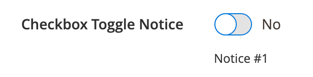
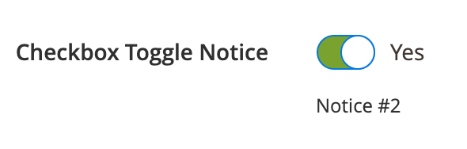

# CheckboxToggleNotice component

The CheckboxToggleNotice component implements the [`Checkbox`](checkbox.md) component with the ability to switch notice according to the selected option.

## Options

| Option | Description | Type | Default |
| --- | --- | --- | --- |
| `component` | The path to the component’s JS constructor in terms of RequireJS. | String | `Magento_Ui/js/form/element/single-checkbox-toggle-notice` |
| `notices` | The array of notices that should be associated by key with selected option value. | Array | `[]` |
| `tracks`.`notice` | Flags that enable tracking for the `notice` option. By default, the `notice` option is tracked to allow updating the notice message in the template. | Boolean | `true` |

## Source files

Extends the [`Checkbox`](checkbox.md) component:

-  [app/code/Magento/Ui/view/base/web/js/form/element/single-checkbox-toggle-notice.js](https://github.com/magento/magento2/blob/2.4/app/code/Magento/Ui/view/base/web/js/form/element/single-checkbox-toggle-notice.js)

## Example

### Integration

This is an example of how to integrate the CheckboxToggleNotice component with the [Form](form.md) component:

```xml
<form>
    ...
    <fieldset>
        ...
        <field name="checkbox_toggle_notice_example" component="Magento_Ui/js/form/element/single-checkbox-toggle-notice" formElement="checkbox">
            <argument name="data" xsi:type="array">
                <item name="config" xsi:type="array">
                    <item name="default" xsi:type="number">0</item>
                    <item name="notices" xsi:type="array">
                        <item name="0" xsi:type="string" translate="true">Notice #1</item>
                        <item name="1" xsi:type="string" translate="true">Notice #2</item>
                    </item>
                </item>
            </argument>
            <settings>
                <dataType>boolean</dataType>
                <label translate="true">Checkbox Toggle Notice</label>
            </settings>
            <formElements>
                <checkbox>
                    <settings>
                        <valueMap>
                            <map name="false" xsi:type="number">0</map>
                            <map name="true" xsi:type="number">1</map>
                        </valueMap>
                        <prefer>toggle</prefer>
                    </settings>
                </checkbox>
            </formElements>
        </field>
    </fieldset>
</form>
```

#### Result



