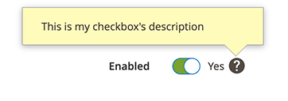
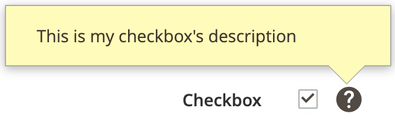
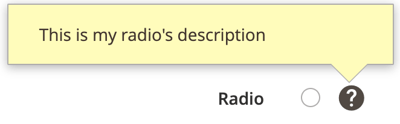

# Checkbox component

The Checkbox component implements a form field that is an [HTML](https://glossary.magento.com/html) `<input type="checkbox">` element. It can also be displayed as a "toggle" handler or a radio button element.

## Options

| Option | Description | Type | Default |
| --- | --- | --- | --- |
| `checked` | Initial checkbox state (selected or cleared). If `false`, the checkbox is cleared. If `true`, the checkbox is selected. | Boolean | `false` |
| `component` | The path to the component’s `.js` file in terms of RequireJS. | String | `Magento_Ui/js/form/element/single-checkbox` |
| `label` | Label to be displayed in the field. | String | `''` |
| `multiple` | Renders multiple elements. | Boolean | `false` |
| `prefer` | The input type of the element to be rendered. Can be either radio button, checkbox, or toggle key. Changing this value also changes the `elementTmpl`, originally defined in the parent (`abstract`) component. | String (`radio` \| `checkbox` \| `toggle`) | `checkbox` |
| `template` | The path to the component’s `.html` template. | String | `ui/form/field` |
| `templates` | Paths to templates for all possible types of input elements. The exact template to be used for rendering is defined by the `prefer` property. | Object | `{radio: 'ui/form/components/single/radio', checkbox: 'ui/form/components/single/checkbox', toggle: 'ui/form/components/single/switcher'}` |
| `valueMap` | Convert the component's value to the expected type. For example, you can set to convert '0' to 'false', this would look like following: <br />`{'0': false}` | Object | `{}` |

## Source files

Extends [`Abstract`](https://github.com/magento/magento2/blob/2.4/app/code/Magento/Ui/view/base/web/js/form/element/abstract.js):

-  [app/code/Magento/Ui/view/base/web/js/form/element/single-checkbox.js](https://github.com/magento/magento2/blob/2.4/app/code/Magento/Ui/view/base/web/js/form/element/single-checkbox.js)
-  [app/code/Magento/Ui/view/base/web/templates/form/components/single/checkbox.html](https://github.com/magento/magento2/blob/2.4/app/code/Magento/Ui/view/base/web/templates/form/components/single/checkbox.html)
-  [app/code/Magento/Ui/view/base/web/templates/form/components/single/radio.html](https://github.com/magento/magento2/blob/2.4/app/code/Magento/Ui/view/base/web/templates/form/components/single/radio.html)
-  [app/code/Magento/Ui/view/base/web/templates/form/components/single/switcher.html](https://github.com/magento/magento2/blob/2.4/app/code/Magento/Ui/view/base/web/templates/form/components/single/switcher.html)
-  [app/code/Magento/Ui/view/base/web/templates/form/field.html](https://github.com/magento/magento2/blob/2.4/app/code/Magento/Ui/view/base/web/templates/form/field.html)

## Examples

### Integration (toggle element)

This is an example of how to integrate the Checkbox component with the [Form](form.md) component:

```xml
<form>
    <fieldset>
        <field name="myCheckbox" formElement="checkbox">
            <settings>
                <label translate="true">Enabled</label>
                <tooltip>
                    <description translate="true">This is my checkbox's description</description>
                </tooltip>
            </settings>
            <formElements>
                <checkbox>
                    <settings>
                        <prefer>toggle</prefer>
                        <valueMap>
                            <map name="false" xsi:type="boolean">false</map>
                            <map name="true" xsi:type="boolean">true</map>
                        </valueMap>
                    </settings>
                </checkbox>
            </formElements>
        </field>
    </fieldset>
</form>
```

#### Result



### Integration (checkbox element)

This is an example of how to integrate the Checkbox component with the [Form](form.md) component:

```xml
<form>
    <fieldset>
        <field name="myCheckbox" formElement="checkbox">
            <settings>
                <label translate="true">Checkbox</label>
                <tooltip>
                    <description translate="true">This is my checkbox's description</description>
                </tooltip>
            </settings>
            <formElements>
                <checkbox>
                    <settings>
                        <prefer>checkbox</prefer>
                        <valueMap>
                            <map name="false" xsi:type="boolean">false</map>
                            <map name="true" xsi:type="boolean">true</map>
                        </valueMap>
                    </settings>
                </checkbox>
            </formElements>
        </field>
    </fieldset>
</form>
```

#### Result



### Integration (radio element)

This is an example of how to integrate the Checkbox component with the [Form](form.md) component:

```xml
<form>
    <fieldset>
        <field name="myRadio" formElement="checkbox">
            <settings>
                <label translate="true">Radio</label>
                <tooltip>
                    <description translate="true">This is my radio's description</description>
                </tooltip>
            </settings>
            <formElements>
                <checkbox>
                    <settings>
                        <prefer>radio</prefer>
                        <valueMap>
                            <map name="false" xsi:type="boolean">false</map>
                            <map name="true" xsi:type="boolean">true</map>
                        </valueMap>
                    </settings>
                </checkbox>
            </formElements>
        </field>
    </fieldset>
</form>
```

#### Result


