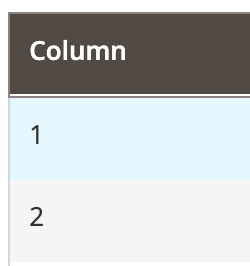

# Column component

The Column component implements a basic column in [Listing](listing-grid.md).

## Options

| Option | Description | Type | Default |
| --- | --- | --- | --- |
| `bodyTmpl` | Path to the template used for rendering column's fields in the table's body. | String | `ui/grid/cells/text` |
| `class` | The path to the component class. | String | `Magento\Ui\Component\Listing\Columns\Column` |
| `component` | The path to the component's `.js` file in terms of RequireJS. | String | `Magento_Ui/js/grid/columns/column` |
| `controlVisibility` | Whether a user can control column's visibility handled by the [ColumnsControls component](columns-controls.md). | Boolean | `true` |
| `disableAction` | Disables the action set in the `templates.fieldAction` property. | Boolean | `false` |
| `draggable` | Defines if a user can change column's position in the table by grabbing column's header and dragging it across the table. | Boolean | `true` |
| `editor` |  | String \| Object |  |
| `fieldClass` | Additional CSS classes added to the column's field elements. | {[name: String]: Boolean} | `''` |
| `filter` | Reference to one of the available filter types defined in the [Filters component](filters.md). If the value represents an object containing the `filterType` field, this object is considered as an extension of the referenced filter element. If there's no such field in the value object, it is considered as a definition of a custom filter element. | String \| Object | `-` |
| `headerTmpl` | Path to the `.html` template for the column's header. | String | `ui/grid/columns/text` |
| `label` | The column label displayed in the header. | String | `''` |
| `sortable` | Whether column's fields can be used to sort records in a table. | Boolean | `true` |
| `sorting` | Column's sorting order. Can be ascending (`asc`), descending (`desc`) or none (`false`). Setting `sorting` to `false` does not disable sorting, which is defined by the `sortable` option. | String \| Boolean | `false` |
| `statefull` | Defined in the parent [uiElement class](../concepts/element.md). | Object | `{visible: true, sorting: true}` |
| `templates.fieldAction` | The action performed on the column's field click. | [ColumnAction](#columnaction-interface) | `-` |
| `visible` | Initial component's visibility. When set to `false`, the `display: none` CSS style is added to the component's DOM block. | Boolean | `true` |

### ColumnAction interface

| Option | Description | Type | Required |
| --- | --- | --- | --- |
| `params` | A list of arguments that will be passed to the method. | Array | Optional |
| `provider` | Reference to component. | String | Required |
| `target` | Name of the component's method to be invoked. | String | Required |

## Source files

Extends [`UiElement`](../concepts/element.md):

-  [`Magento/Ui/Component/Listing/Columns/Column.php`](https://github.com/magento/magento2/blob/2.4/app/code/Magento/Ui/Component/Listing/Columns/Column.php)
-  [`Magento/Ui/view/base/web/js/grid/columns/column.js`](https://github.com/magento/magento2/blob/2.4/app/code/Magento/Ui/view/base/web/js/grid/columns/column.js)
-  [`Magento/Ui/view/base/web/templates/grid/cells/text.html`](https://github.com/magento/magento2/blob/2.4/app/code/Magento/Ui/view/base/web/templates/grid/cells/text.html)
-  [`Magento/Ui/view/base/web/templates/grid/columns/text.html`](https://github.com/magento/magento2/blob/2.4/app/code/Magento/Ui/view/base/web/templates/grid/columns/text.html)

## Examples

### Integration

This is an example of how the Column component integrates with the [Listing](listing-grid.md) component:

```xml
<listing>
    ...
    <columns>
        ...
        <column name="column" sortOrder="10">
            <settings>
                <filter>text</filter>
                <dataType>text</dataType>
                <label translate="true">Column</label>
            </settings>
        </column>
        ...
    </columns>
    ...
</listing>
```

#### Result



### Configure Field Action for Column component

This is an example of how the `fieldAction` option can be configured for the Column component.

```xml
<column name="column_with_action">
    <argument name="data" xsi:type="array">
        <item name="config" xsi:type="array">
            <item name="fieldAction" xsi:type="array">
                <item name="provider" xsi:type="string">TARGET_NAME</item>
                <item name="target" xsi:type="string">ACTION_NAME</item>
                <item name="params" xsi:type="array">
                    <!-- provide record index as a parameter for target method -->
                    <item name="0" xsi:type="string">${ $.$data.rowIndex }</item>
                </item>
            </item>
        </item>
    </argument>
    <settings>
        <filter>text</filter>
        <dataType>text</dataType>
        <label translate="true">Column</label>
    </settings>
</column>
```
