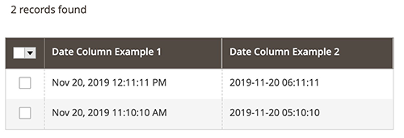

# DateColumn component

The DateColumn component implements a table column that displays dates.

## Options

| Option | Description | Type | Default |
| --- | --- | --- | --- |
| `dateFormat` | Date format for the displayed column's values. | String | `MMM d, YYYY h:mm:ss A` |
| `skipTimeZoneConversion` | Converts the given date to default (UTC) timezone. | Boolean | `true` |
| `timezone` | Enables date conversion based on the timezone configuration. | Boolean | `true` |

## Source files

Extends [`Column`](column.md):

-  [`app/code/Magento/Ui/view/base/web/js/grid/columns/date.js`](https://github.com/magento/magento2/blob/2.4/app/code/Magento/Ui/view/base/web/js/grid/columns/date.js)

## Examples

### Integration

This is an example of how the DateColumn component integrates with the [Listing](listing-grid.md) component:

```xml
<listing>
    ...
    <columns>
        <column name="date_column_example_1" class="Magento\Ui\Component\Listing\Columns\Date" component="Magento_Ui/js/grid/columns/date">
            <settings>
                <filter>dateRange</filter>
                <dataType>date</dataType>
                <label translate="true">Date Column Example 1</label>
            </settings>
        </column>
        <column name="date_column_example_2" class="Magento\Ui\Component\Listing\Columns\Date" component="Magento_Ui/js/grid/columns/date">
            <settings>
                <filter>dateRange</filter>
                <dataType>date</dataType>
                <dateFormat>yyyy-MM-dd hh:mm:ss</dateFormat>
                <label translate="true">Date Column Example 2</label>
                <timezone>false</timezone>
            </settings>
        </column>
        ...
    </columns>
    ...
</listing>
```

#### Result


