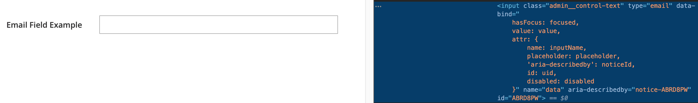

# Email component

The Email component implements the HTML `<input type="email">` form field.

## Options

| Option | Description | Type | Default |
| --- | --- | --- | --- |
| `component` | The path to the component’s `.js` file. | String | `Magento_Ui/js/form/element/abstract` |
| `elementTmpl` | The path to the `.html` template of the particular field type. | String | `ui/form/element/email` |
| `template` | The path to the general field `.html` template. | String | `ui/form/field` |

## Source files

Extends [`Abstract`](https://github.com/magento/magento2/blob/2.4/app/code/Magento/Ui/view/base/web/js/form/element/abstract.js):

-  [app/code/Magento/Ui/view/base/web/js/form/element/abstract.js](https://github.com/magento/magento2/blob/2.4/app/code/Magento/Ui/view/base/web/js/form/element/abstract.js)
-  [app/code/Magento/Ui/view/base/web/templates/form/element/email.html](https://github.com/magento/magento2/blob/2.4/app/code/Magento/Ui/view/base/web/templates/form/element/email.html)
-  [app/code/Magento/Ui/view/base/web/templates/form/field.html](https://github.com/magento/magento2/blob/2.4/app/code/Magento/Ui/view/base/web/templates/form/field.html)

## Examples

### Integration

This example integrates the Paging component with the [Form](form.md) component

```xml
<form>
    ...
    <fieldset>
        ...
        <email name="email_example">
            <settings>
                <label translate="true">Email Field Example</label>
            </settings>
        </email>
    </fieldset>
</form>
```

#### Result


