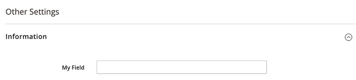

# Fieldset component

The Fieldset component implements a container for visually-grouped form elements, such as buttons and form fields.

## Options

| Title               | Type    | Default | Description                                                                                                               |
| ------------------- | ------- | ------- | ------------------------------------------------------------------------------------------------------------------------- |
| `disabled`          | Boolean | `false` | Initial component's state. When `true`, users cannot take action on the element.                                          |
| `label`             | String  |         | Caption for an item in the UI component context.                                                                          |
| `visible`           | Boolean | `true`  | Initial component's visibility. When set to `false`, the `display: none` CSS style is added to the component's DOM block. |
| `additionalClasses` | Object  | `{}`      | Custom classes added to the component's DOM block.                                                                        |
| `level`             | Integer |         | Explicitly indicates the level of nesting([date-level] attribute).                                                        |

### collapsible configuration

| Title         | Type    | Default | Description                                                                       |
| ------------- | ------- | ------- | --------------------------------------------------------------------------------- |
| `collapsible` | Boolean | `false` | Enables/disables the collapsible functionality.                                   |
| `label`       | String  |         | Caption for the fieldset.                                                         |
| `opened`      | Boolean | `false` | Initial collapsible state. Applied when the collapsible functionality is enabled. |

## Examples

### Integration

The following example adds a new main fieldset that contains a collapsible fieldset into the [Form](form.md) component:

```xml
<form>
    <fieldset name="main_fieldset">
        <settings>
            <label translate="true">Other Settings</label>
        </settings>
        <fieldset name="fieldset_group">
            <argument name="data" xsi:type="array">
                <item name="config" xsi:type="array">
                    <item name="label" xsi:type="string" translate="true">Information</item>
                    <item name="collapsible" xsi:type="boolean">true</item>
                    <item name="opened" xsi:type="boolean">true</item>
                </item>
            </argument>
            <field name="my_field">
                <argument name="data" xsi:type="array">
                    <item name="config" xsi:type="array">
                        <item name="label" xsi:type="string" translate="true">My Field</item>
                        <item name="visible" xsi:type="boolean">true</item>
                        <item name="dataType" xsi:type="string">text</item>
                        <item name="formElement" xsi:type="string">input</item>
                    </item>
                </argument>
            </field>
        </fieldset>
    </fieldset>
</form>
```

#### Result



## Source files

Extends [`uiCollection`](../concepts/collection.md) and `collapsible`:

-  [`Magento/Ui/Component/Form/Fieldset.php`](https://github.com/magento/magento2/blob/2.4/app/code/Magento/Ui/Component/Form/Fieldset.php)
-  [`Magento/Ui/view/base/web/js/form/components/fieldset.js`](https://github.com/magento/magento2/blob/2.4/app/code/Magento/Ui/view/base/web/js/form/components/fieldset.js)
-  [`Magento/Ui/view/base/web/templates/form/fieldset.html`](https://github.com/magento/magento2/blob/2.4/app/code/Magento/Ui/view/base/web/templates/form/fieldset.html)
-  [`Magento/Ui/view/base/ui_component/etc/definition/fieldset.xsd`](https://github.com/magento/magento2/blob/2.4/app/code/Magento/Ui/view/base/ui_component/etc/definition/fieldset.xsd)
