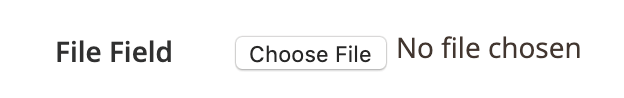

# File component

The File component implements the HTML `<input type="file">` form field.

## Options

| Option | Description | Type | Default |
| --- | --- | --- | --- |
| `component` | The path to the component’s JS constructor in terms of RequireJS. | String | `Magento_Ui/js/form/element/media` |
| `label` | Label to be displayed in the field. | String | `''` |
| `links`.`value` | [Links](../concepts/linking.md) the component's `value` property with provider using the declared in the `dataScope` property of the parent component. | Boolean | `''` |
| `disabled` | Initial component's state. When set to `true`, users cannot take action on the element. | Boolean | `false` |
| `visible` | Initial component's visibility. When set to `false`, the `display: none` CSS style is added to the component's DOM block. | Boolean | `true` |

## Source files

Extends [`Abstract`](https://github.com/magento/magento2/blob/2.4/app/code/Magento/Ui/view/base/web/js/form/element/abstract.js):

-  [`app/code/Magento/Ui/view/base/web/js/form/element/media.js`](https://github.com/magento/magento2/blob/2.4/app/code/Magento/Ui/view/base/web/js/form/element/media.js)
-  [`app/code/Magento/Ui/view/base/web/templates/form/element/media.html`](https://github.com/magento/magento2/blob/2.4/app/code/Magento/Ui/view/base/web/templates/form/element/media.html)
-  [`app/code/Magento/Ui/view/base/web/templates/form/field.html`](https://github.com/magento/magento2/blob/2.4/app/code/Magento/Ui/view/base/web/templates/form/field.html)

## Examples

### Integration

This is an example of how the File component integrates with the [Form](form.md) component:

```xml
<form>
    ...
    <fieldset>
        ...
        <file name="file_example">
            <argument name="data" xsi:type="array">
                <item name="config" xsi:type="array">
                    <item name="label" xsi:type="string">File Field</item>
                    <item name="visible" xsi:type="boolean">true</item>
                    <item name="formElement" xsi:type="string">fileUploader</item>
                    <item name="uploaderConfig" xsi:type="array">
                        <item name="url" xsi:type="url" path="path/to/controller"/>
                    </item>
                </item>
            </argument>
        </file>
    </fieldset>
</form>
```

#### Result


