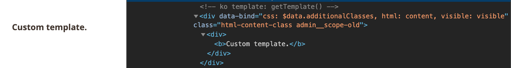

# HtmlContent component

The HtmlContent UI component provides the ability to process and render a layout structure or a block directly inside a UI component configuration. Processing and rendering is executed on the server side.

The layout structure inside HtmlContent must contain only one top-level block. The top-level block may contain as many child blocks or containers as required.
All blocks inside HtmlContent are integrated into the layout, so external blocks can refer to them and vice verse.

## Options

| Option | Description | Type | Default |
| --- | --- | --- | --- |
| `additionalClasses` | Sets custom classes to the component's DOM block. | Object | `{}` |
| `class` | The path to the component class. | String | `Magento\Ui\Component\HtmlContent` |
| `component` | The path to the component’s JS constructor in terms of RequireJS. | String | `Magento_Ui/js/form/components/html` |
| `content` | HTML content to be displayed. | String | `''` |
| `template` | The path to the component’s `.html` template. | String | `ui/content/content` |
| `visible` | Initial component's visibility. When set to "false", the `display: none` CSS style is added to the component's DOM block. | Boolean | `true` |

## Examples

### Render layout

```xml
<form xmlns:xsi="http://www.w3.org/2001/XMLSchema-instance" xsi:noNamespaceSchemaLocation="urn:magento:module:Magento_Ui:etc/ui_configuration.xsd">
    <htmlContent name="customer_edit_tab_view">
       <block class="Magento\Customer\Block\Adminhtml\Edit\Tab\View" name="customer_edit_tab_view" template="Magento_Customer::tab/view.phtml">
         <arguments>
                <argument name="sort_order" xsi:type="number">10</argument>
                <argument name="tab_label" xsi:type="string" translate="true">Customer View</argument>
         </arguments>
         <block class="Magento\Customer\Block\Adminhtml\Edit\Tab\View\PersonalInfo" name="personal_info" template="Magento_Customer::tab/view/personal_info.phtml"/>
       </block>
    </htmlContent>
</form>
```

### Render simple block

```xml
<form xmlns:xsi="http://www.w3.org/2001/XMLSchema-instance" xsi:noNamespaceSchemaLocation="urn:magento:module:Magento_Ui:etc/ui_configuration.xsd">
    <htmlContent name="giftregistry">
        <block class="Magento\GiftRegistry\Block\Adminhtml\Customer\Edit\Tab\Giftregistry" name="giftregistry"/>
    </htmlContent>
</form>
```

### Integration

This example integrates the HtmlContent component with the [Form](form.md) component.

```xml
<form>
    <htmlContent name="html_content">
        <settings>
            <additionalClasses>
                <class name="html-content-class">true</class>
            </additionalClasses>
        </settings>
        <block name="html_content_block" class="Magento\Backend\Block\Template">
            <arguments>
                <argument name="template" xsi:type="string">Vendor_Module::template.phtml</argument>
            </arguments>
        </block>
    </htmlContent>
</form>
```

Template `Vendor/Module/view/adminhtml/templates/template.phtml`:

```php
<?php
/** @var \Magento\Framework\Escaper $escaper */
?>

<div>
    <b><?= $escaper->escapeHtml(__('Custom template.')); ?></b>
</div>
```

#### Result



## Source files

Extends `uiComponent`:

-  [app/code/Magento/Ui/view/base/web/js/form/components/html.js](https://github.com/magento/magento2/blob/2.4/app/code/Magento/Ui/view/base/web/js/form/components/html.js)
-  [app/code/Magento/Ui/view/base/web/templates/content/content.html](https://github.com/magento/magento2/blob/2.4/app/code/Magento/Ui/view/base/web/templates/content/content.html)
-  [app/code/Magento/Ui/Component/HtmlContent.php](https://github.com/magento/magento2/blob/2.4/app/code/Magento/Ui/Component/HtmlContent.php)
