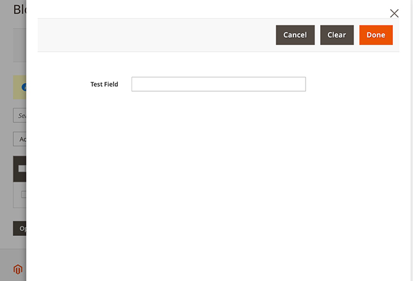
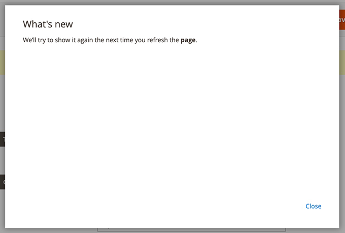

# Modal

The Modal UI component implements a secondary window that opens on top of the main window. It uses the [modal widget](../../javascript/jquery-widgets/modal.md).

Similar to the widget's configuration, the component's configuration allows you to set the window type and the behavior of action buttons (including linking action buttons to methods of the other UI components).

The Modal component can be used for both Admin and storefronts.

For recommendations about modal windows usage from the UX point of view, see the corresponding topic in the [Admin pattern library](https://developer.adobe.com/commerce/admin-developer/pattern-library/containers/slideouts-modals-overlays/).

## Options

Component's options are set in the configuration `.xml` file as follows:

```xml
<modal name="test_modal">
    <argument name="data" xsi:type="array">
        <item name="config" xsi:type="array">
            <!-- Configurable options are specified here -->
            <item name="%option1%" xsi:type="%type%">%value%</item>
            <item name="%option2%" xsi:type="%type%">%value%</item>
            ...
        </item>
    </argument>
</modal>
```

| Option | Description | Type | Default |
| --- | --- | --- | --- |
| `modalClass` | CSS class applied to the root node of the component's `.html` template. | String | `modal-component` |
| `onCancel` | Name of the method invoked when a user attempts to close the modal window. | String | `closeModal` |
| `options` | Configuration passed to the [modal widget](../../javascript/jquery-widgets/modal.md). | Object | ```{modalClass: '',title: '',subTitle: '',buttons: [],keyEventHandlers: {}}``` |
| `subTitle` | Subtitle of the modal window. | String | `''` |
| `template` | Path to the component's `.html` template. | String | `ui/modal/modal-component` |
| `title` | Label displayed in the header of the modal window. | String | `''` |
| `valid` | The modal validity value. | Boolean | `true` |

## Examples

### Configure component

The following sample is an example of the configuration for a simple modal window containing one text field and a standard set of action buttons (**Cancel**, **Clear**, **Done**):

```xml
<modal name="test_modal">
    <argument name="data" xsi:type="array">
        <item name="config" xsi:type="array">
            <item name="onCancel" xsi:type="string">actionCancel</item>
            <item name="options" xsi:type="array">
                <item name="buttons" xsi:type="array">
                    <item name="0" xsi:type="array">
                        <item name="text" xsi:type="string">Cancel</item>
                        <item name="class" xsi:type="string">action-secondary</item>
                        <item name="actions" xsi:type="array">
                            <item name="0" xsi:type="string">actionCancel</item>
                        </item>
                    </item>
                    <item name="1" xsi:type="array">
                        <item name="text" xsi:type="string">Clear</item>
                        <item name="class" xsi:type="string">action-secondary</item>
                        <item name="actions" xsi:type="array">
                            <item name="0" xsi:type="array">
                                <item name="targetName" xsi:type="string">${ $.name }.testField</item>
                                <item name="actionName" xsi:type="string">clear</item>
                            </item>
                        </item>
                    </item>
                    <item name="2" xsi:type="array">
                        <item name="text" xsi:type="string">Done</item>
                        <item name="class" xsi:type="string">action-primary</item>
                        <item name="actions" xsi:type="array">
                            <item name="0" xsi:type="string">actionDone</item>
                        </item>
                    </item>
                </item>
            </item>
        </item>
    </argument>
    <fieldset name="general">
        <settings>
            <label/>
        </settings>
        <field name="testField" formElement="input">
            <settings>
                <dataType>text</dataType>
                <label translate="true">Test Field</label>
            </settings>
        </field>
    </fieldset>
</modal>

<button name="modal_button">
    <argument name="data" xsi:type="array">
        <item name="config" xsi:type="array">
            <item name="title" xsi:type="string">Open modal</item>
            <item name="actions" xsi:type="array">
                <item name="0" xsi:type="array">
                    <item name="targetName" xsi:type="string">${ $.parentName}.test_modal</item>
                    <item name="actionName" xsi:type="string">openModal</item>
                </item>
            </item>
        </item>
    </argument>
</button>
```

#### Result

The Button component `Open modal` is added, that onClick, opens a modal window with a `slide` effect.



### Component with extended settings

```xml
<modal name="test_notification">
    <settings>
        <onCancel>actionCancel</onCancel>
        <state>true</state>
        <options>
            <option name="modalClass" xsi:type="string">release-notification-modal</option>
            <option name="title" xsi:type="string" translate="true">What's new?</option>
            <option name="type" xsi:type="string">popup</option>
            <option name="responsive" xsi:type="boolean">true</option>
            <option name="innerScroll" xsi:type="boolean">true</option>
            <option name="autoOpen" xsi:type="boolean">true</option>
        </options>
    </settings>
    <fieldset name="notification_fieldset">
        <settings>
            <label/>
        </settings>
        <container name="notification_text" template="ui/form/components/complex">
            <argument name="data" xsi:type="array">
                <item name="config" xsi:type="array">
                    <item name="label" xsi:type="string"/>
                    <item name="additionalClasses" xsi:type="string">release-notification-text</item>
                    <item name="text" xsi:type="string" translate="true"><![CDATA[
                <p>We’ll try to show it again the next time you refresh the <b>page</b>.</p>]]></item>
                </item>
            </argument>
        </container>
        <container name="notification_buttons">
            <argument name="data" xsi:type="array">
                <item name="config" xsi:type="array">
                    <item name="label" xsi:type="string"/>
                </item>
            </argument>
            <button name="notification_close_button" displayArea="actions-secondary">
                <argument name="data" xsi:type="array">
                    <item name="config" xsi:type="array">
                        <item name="buttonClasses" xsi:type="string">release-notification-button-next</item>
                        <item name="actions" xsi:type="array">
                            <item name="0" xsi:type="array">
                                <item name="targetName" xsi:type="string">ns = ${ $.ns }, index = notification_modal_1</item>
                                <item name="actionName" xsi:type="string">closeModal</item>
                            </item>
                        </item>
                    </item>
                </argument>
                <settings>
                    <displayAsLink>true</displayAsLink>
                    <title><![CDATA[Close]]></title>
                </settings>
            </button>
        </container>
    </fieldset>
</modal>
```

#### Result

As a result, the modal window auto-opens on page load with a `popup` effect.



## Source files

Extends [`uiCollection`](../concepts/collection.md):

-  [`Magento_Ui_module_dir/view/base/web/js/modal/modal-component.js`](https://github.com/magento/magento2/blob/2.4/app/code/Magento/Ui/view/base/web/js/modal/modal-component.js)
-  [`Magento_Ui_module_dir/view/base/web/templates/modal/modal-component.html`](https://github.com/magento/magento2/blob/2.4/app/code/Magento/Ui/view/base/web/templates/modal/modal-component.html)

### Methods and events

-  `actionCancel()` - returns all modal's child components to the state they had on modal open and closes the modal window.
-  `actionDone()` - validates the changes in the modal's child components and, if valid, closes the modal.
-  `closeModal()` - closes the modal window.
-  `openModal()` - opens the modal window.
-  `setPrevValues(elem)` - returns all `elem`'s child components to the state they had on modal open.
-  `setTitle()` - sets modal title.
-  `setSubTitle()` - sets modal sub title.
-  `toggleModal()` - toggles the modal window state (open/close).
