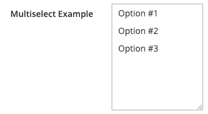

# Multiselect component

The Multiselect component provides the interface for a list or a data set. Multiselect allows selecting multiple items.

## Options

| Option | Description | Type | Default |
| --- | --- | --- | --- |
| `component` | The path to the component's `.js` file in terms of RequireJS. | String | `'Magento_Ui/js/form/element/multiselect'` |
| `elementTmpl` | The path to the `.html` template of the particular field type (multiselect). | String | `'ui/form/element/multiselect'` |
| `size` | The number of options that are displayed in the multiselect UI. | Number | `6` |
| `template` | The path to the general field `.html` template. | String | `'ui/form/field'` |

## Source files

Extends [`Select`](select.md)

-  [app/code/Magento/Ui/view/base/web/js/form/element/multiselect.js](https://github.com/magento/magento2/blob/2.4/app/code/Magento/Ui/view/base/web/js/form/element/multiselect.js)
-  [app/code/Magento/Ui/view/base/web/templates/form/element/multiselect.html](https://github.com/magento/magento2/blob/2.4/app/code/Magento/Ui/view/base/web/templates/form/element/multiselect.html)

## Example

```xml
<form>
    ...
    <fieldset>
        ...
        <field name="multiselect_example" formElement="multiselect">
            <settings>
                <dataType>text</dataType>
                <label translate="true">Multiselect Example</label>
                <dataScope>multiselect_example</dataScope>
            </settings>
            <formElements>
                <multiselect>
                    <settings>
                        <options>
                            <option name="1" xsi:type="array">
                                <item name="value" xsi:type="string">1</item>
                                <item name="label" xsi:type="string">Option #1</item>
                            </option>
                            <option name="2" xsi:type="array">
                                <item name="value" xsi:type="string">2</item>
                                <item name="label" xsi:type="string">Option #2</item>
                            </option>
                            <option name="3" xsi:type="array">
                                <item name="value" xsi:type="string">3</item>
                                <item name="label" xsi:type="string">Option #3</item>
                            </option>
                        </options>
                    </settings>
                </multiselect>
            </formElements>
        </field>
        ...
    </fieldset>
    ...
</form>
```

## Result


