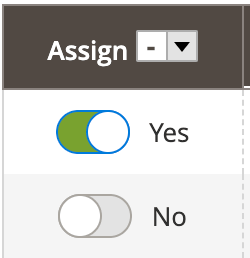

# OnOffColumn component

The OnOffColumn component is a decorator for [MultiselectColumn](multiselect-column.md). It displays toggle switch elements instead of checkboxes.

## Options

| Option | Description | Type                                          | Default Value                                                                                                                    |
| --- | --- |-----------------------------------------------|----------------------------------------------------------------------------------------------------------------------------------|
| `component` | The path to the component’s `.js` file in terms of RequireJS. | String                                        | `Magento_Ui/js/grid/columns/onoff`                                                                                               |
| `bodyTmpl` | Path to the template that is used to render a column's field in the table's body. | String                                        | `ui/grid/cells/onoff`                                                                                                            |
| `fieldClass` | Additional CSS classes added to the column's field elements. | \{\<br /\>`[name: string]: boolean`\<br /\>\} | \{\<br /\>'`admin__scope-old': true,`\<br /\>`'data-grid-onoff-cell': true,`\<br /\>`'data-grid-checkbox-cell': false`\<br /\>\} |
| `headerTmpl` | Path to the `.html` template for the column's header. | String                                        | `ui/grid/columns/onoff`                                                                                                          |

## Source files

Extends [`MultiselectColumn`](multiselect-column.md):

-  [app/code/Magento/Ui/view/base/web/js/grid/columns/onoff.js](https://github.com/magento/magento2/blob/2.4/app/code/Magento/Ui/view/base/web/js/grid/columns/onoff.js)
-  [app/code/Magento/Ui/view/base/web/templates/grid/cells/onoff.html](https://github.com/magento/magento2/blob/2.4/app/code/Magento/Ui/view/base/web/templates/grid/cells/onoff.html)
-  [app/code/Magento/Ui/view/base/web/templates/grid/columns/onoff.html](https://github.com/magento/magento2/blob/2.4/app/code/Magento/Ui/view/base/web/templates/grid/columns/onoff.html)

## Examples

### Integration

This example integrates the OnOffColumn component with the [Listing](listing-grid.md) component:

```xml
<listing>
    ...
    <columns>
        ...
        <column name="on_off_column_example_1" component="Magento_Ui/js/grid/columns/onoff">
            <settings>
                <dataType>select</dataType>
            </settings>
        </column>
    </columns>
</listing>
```

#### Result


