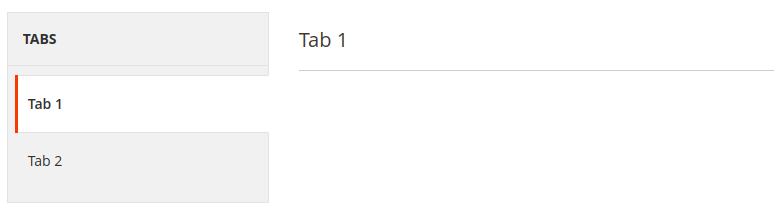

# Tab component

The Tab component implements a tab content area.

See the [Admin Design Pattern Library (Tabs)](https://developer.adobe.com/commerce/admin-developer/pattern-library/containers/tabs) topic for information about the UI design patterns that can be implemented using the Tab component.

## Options

| Option      | Description                                                        | Type   | Default                              |
|-------------|--------------------------------------------------------------------|--------|--------------------------------------|
| `component` | The path to the component's JS constructor, in terms of RequireJS. | String | `Magento_Ui/js/form/components/area` |
| `template`  | The path to the component's `.html` template.                      | String | `templates/layout/tabs/tab/default`  |
| `uniqueNs`  | Unique namespace for the component.                                | String | `params.activeArea`                  |

## Examples

### Integration

This example integrates the Tab component with the [Form](form.md) component.

```xml
<form>
    ...
    <argument name="data" xsi:type="array">
        ...
        <item name="label" xsi:type="string" translate="true">Tabs</item>
    </argument>
    <settings>
        ...
        <layout>
            <navContainerName>left</navContainerName>
            <type>tabs</type>
        </layout>
    </settings>
    <fieldset name="tab1">
        <settings>
            ...
            <label translate="true">Tab 1</label>
        </settings>
        ...
    </fieldset>
    <fieldset name="tab2">
        <settings>
            ...
            <label translate="true">Tab 2</label>
        </settings>
        ...
    </fieldset>
</form>
```

#### Results


