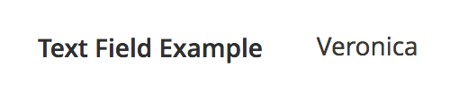

# Text component

The Text component displays text data in the components like [Form](form.md) and [DynamicRows](dynamic-rows.md).

## Options

| Option | Description | Type | Default |
| --- | --- | --- | --- |
| `class` | The path to the component class. | String | `Magento\Ui\Component\Form\Element\DataType\Text` |
| `component` | The path to the component’s `.js` file in terms of RequireJS. | String | `Magento_Ui/js/form/element/text` |
| `disabled` | Initial component's state. When set to `true`, users can't take action on the element. | Boolean | `false` |
| `elementTmpl` | The path to the `.html` template of the particular field type. | String | `ui/form/element/text` |
| `label` | Label to be displayed in the field. | String | `''` |
| `links`.`value` | [Links](../concepts/linking.md) the component's "value" property with provider using the declared in the "dataScope" property of the parent component. | String | `${ $.provider }:${ $.dataScope }` |
| `visible` | Initial component's visibility. When set to `false`, the "display: none" CSS style is added to the component's DOM block. | Boolean | `true` |

## Source files

Extends [`UiElement`](../concepts/element.md):

-  [app/code/Magento/Ui/view/base/web/js/form/element/text.js](https://github.com/magento/magento2/blob/2.4/app/code/Magento/Ui/view/base/web/js/form/element/text.js)

## Examples

### Integration

The following example integrates the Text component with the [Form](form.md) component and displays the customer's first name in the admin, on the Customer Edit page:

```xml
<form>
    ...
    <fieldset>
        ...
        <field name="text_example" formElement="input" sortOrder="10">
            <settings>
                <elementTmpl>ui/form/element/text</elementTmpl>
                <label translate="true">Text Field Example</label>
                <imports>
                    <link name="value">${ $.provider }:data.customer.firstname</link>
                </imports>
            </settings>
        </field>
    </fieldset>
</form>
```

#### Result


