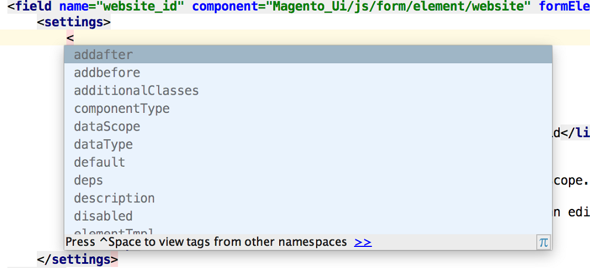
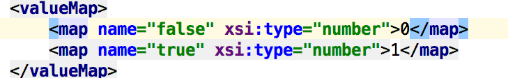
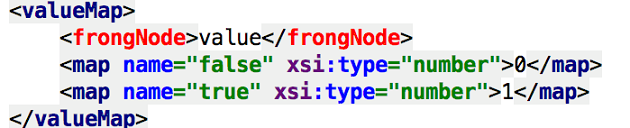
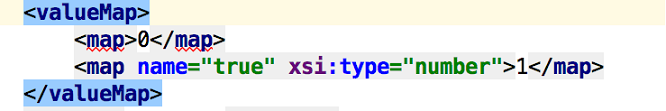
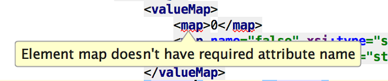
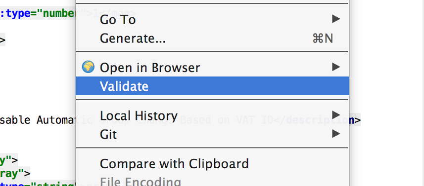
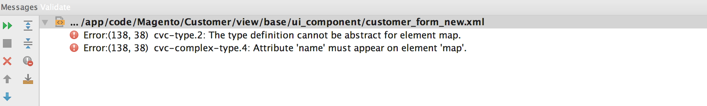

# Semantic configuration

Adobe Commerce and Magento Open Source 2.2.0 introduced a new structure for [UI components XML configuration](xml-declaration.md), aimed at improving configuration semantics.

The arbitrary structure, used in UI components XML configuration in previous versions, is also supported, and during XML files merging, the configuration files that use the arbitrary structure have higher priority.

Still, using the new structure for your customizations in 2.2.0 and later, is the best practice, because the old "arbitrary" structure will become deprecated at some point.

<InlineAlert variant="info" slots="text" />

Declaring the custom UI component is an exception, use the arbitrary structure when [declaring a custom UI component].

The main advantages of the new structure are described in the following sections.

## Readability

All components options are separate nodes, and a node's purpose is defined by its name. The number of abstract-named nodes like `<item>` or `<argument>` is minimized.

```xml
<field name="default_billing" formElement="checkbox">
    <argument name="data" xsi:type="array">
        <item name="config" xsi:type="array">
            <item name="source" xsi:type="string">customer</item>
        </item>
    </argument>
    <settings>
        <dataType>boolean</dataType>
        <visible>false</visible>
    </settings>
</field>
<field name="default_shipping" formElement="checkbox">
    <argument name="data" xsi:type="array">
        <item name="config" xsi:type="array">
            <item name="source" xsi:type="string">customer</item>
        </item>
    </argument>
    <settings>
        <dataType>boolean</dataType>
        <visible>false</visible>
    </settings>
</field>
<field name="website_id" component="Magento_Ui/js/form/element/website" formElement="select">
    <argument name="data" xsi:type="array">
        <item name="config" xsi:type="array">
            <item name="source" xsi:type="string">customer</item>
        </item>
    </argument>
    <settings>
        <validation>
            <rule name="required-entry" xsi:type="boolean">true</rule>
        </validation>
        <dataType>number</dataType>
        <tooltip>
            <link>https://experienceleague.adobe.com/docs/commerce-admin/start/setup/websites-stores-views.html#scope-settings</link>
            <description translate="true">If your installation has multiple websites, you can edit the scope to associate the customer with a specific site.</description>
        </tooltip>
        <imports>
            <link name="customerId">${ $.provider }:data.customer.entity_id</link>
        </imports>
    </settings>
</field>
```

## Autocomplete

When editing XML configuration files in an IDE, the autocomplete feature prompts the correct spelling and the possible options.

*  Node declaration autocomplete:



*  Attribute declaration autocomplete:


*  The application supports autocomplete for all nesting levels of options which have static interface. If an option doesn't have defined interface, the additional property is used to declare option name and type:



## Validation

When editing XML configuration files in an IDE, you get visual notifications if the name of a node or attribute is misspelled, or a required attribute is missing. You can also validate the complete file, by clicking **Validate** in the context menu.

*  If the node name is misspelled:



*  If the required attribute is missing:



*  The tooltip displayed if you move the pointer over the underlined element:



*  Validating the complete file:




<InlineAlert variant="info" slots="text" />

To use the autocomplete and validation features in your IDE, generate the URN as described in the [URN highlighter] topic.

<!--Link Declarations -->

[declaring a custom UI component]: ../howto/new-component-declaration.md
[URN highlighter]: https://experienceleague.adobe.com/docs/commerce-operations/configuration-guide/cli/urn-highlighter.html
