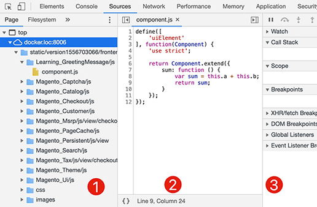
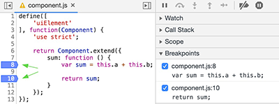
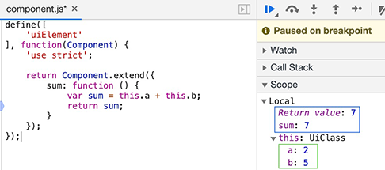

# Debug UI components

This article describes how to define what UI components are used on a particular page, their [JavaScript](https://glossary.magento.com/javascript) components and what data they use.

To define the UI components used on a page, you can use browser built-in developer tools, or install additionally a plugin, for example Knockoutjs context debugger for Google Chrome.

## Knockout.js plugin

To install the knockout debugging plugin for Google Chrome, take the following steps:

1. Open your Google Chrome browser.
1. Expand Google Chrome options drop-down (hamburger in upper right).
1. Select **Settings**.
1. In left pane, select **Extensions**.
1. Scroll to end of the page and click **Get more extensions** link.
1. In the **Search** field write **Knockoutjs context debugger** and press the **Enter** key.
1. In the result, find the [extension](https://glossary.magento.com/extension) named **Knockoutjs context debugger** (usually the first result), and click **Add to Chrome**.

To define the [UI component](https://glossary.magento.com/ui-component) using the plugin:

1. Open the required page in Chrome.
1. Point to the required element on the page, right-click and select **Inspect**. The developer tools panel opens.
1. In the right column of the panel, click the **Knockout context** tab. The tab displays the name and the configuration of the UI component instance.

A simple example:

1. Launch [Admin](https://glossary.magento.com/magento-admin).
1. Navigate to **Products** > **Catalog** and click **Add Product**. The product creation page opens.
1. Right-click on the **Product Name** field and click **Inspect**. Go to the **Knockout context** tab. Here you can see the full context of the field, where you can find JS component file, component name, etc.


## Pure Knockout

To retrieve the context within markup, you can also use the instance of Knockout:

At first we need to get a Knockout instance from the browser console. To do so, use the [RequireJS ID](../javascript/resources.md) `knockout`.

```javascript
var ko = require('knockout');
```

Now we have Knockout instance in the `ko` variable. We can use it to get a context of any DOM element.

```javascript
var context = ko.contextFor($0);
```

, where `$0` is a [special variable](https://developers.google.com/web/tools/chrome-devtools/debug/command-line/command-line-reference#section-1) in browser console. It contains a link to a DOM element that is last inspected.

For example:

```javascript
// Admin > Products > Catalog > Add Product
// Inspect "Product Name"
var fieldName = ko.contextFor($0).$data;

console.log(fieldName.name); // product_form.product_form.product-details.container_name.name
```

## Chrome DevTools

All modern browsers support “debugging” – a special UI in developer tools that makes finding and fixing errors much easier.

### Sources panel UI

[DevTools] provides a lot of different tools for different tasks, but the **Sources** panel is where you debug JavaScript.

1. Open the required page in Chrome.
1. Turn on developer tools with F12 (Windows, Linux) or Cmd+Opt+I (Mac).
1. Click the `Sources` tab.



In the previous image, we can see three zones:

1. The `Resources` zone lists all the files as HTML, JavaScript, CSS.
1. The `Source` zone shows the source code of any selected file.
1. The `Information and control` zone is for debugging.

### Breakpoints

A **breakpoint** is a line of code where the debugger will automatically pause the JavaScript execution process.
To set a breakpoint, right click on the code line number (as shown in the next image).



You can always find a list of breakpoints in the right panel, which is useful when you have many breakpoints in various files.

<InlineAlert variant="info" slots="text" />

Right-clicking on the line number allows you to create a conditional breakpoint, which triggers only when the given expression is truthy. That’s helpful when you need to stop only for certain function parameters.

### Execution trace

After setting the breakpoint, refresh the page. Now, let's explore the script tracing. As you can see in the next image, the script execution paused on the given breakpoint.



As result, you can see the input parameter values and what the function returns. Moreover, we're also able to change the function's values on the fly.

### Invoking DevTools

To use DevTools you can follow the previously described steps, or you can use the `debugger` keyword in your JavaScript code to invoke the browser's DevTools.

```javascript
function sum(a, b) {
    var sum = a + b;
    debugger;
    return sum;
}
```

Then, just make sure that your method is called and wait until the debugger is paused at the specified point.


