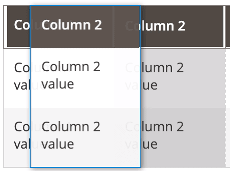

# DragAndDrop component

The DragAndDrop component is an [extension](https://glossary.magento.com/extension) for [Columns](columns.md), allowing users to change columns position in the table.

## Options

| Option | Description | Type | Default Value |
| --- | --- | --- | --- |
| `enabled`| Whether the component is allowed to change the position of columns. | Boolean | `true` |
| `fixedX` | Whether the column has a fixed position on the X-axis. That is, whether it can be moved horizontally. | Boolean | `false` |
| `fixedY` | Whether the column has a fixed position on the Y-axis. That is, whether it can be moved vertically. | Boolean | `true` |
| `noSelectClass` | CSS class applied to the table when one of its columns is being dragged. | String | `'_no-select'` |

## Source files

Extends [`UiCollection`](concepts/collection.md):

-  [`app/code/Magento/Ui/view/base/web/js/grid/dnd.js`](https://github.com/magento/magento2/blob/2.4/app/code/Magento/Ui/view/base/web/js/grid/dnd.js)

## Examples

### Integration

This example configures the DragAndDrop component for the [Columns](columns.md) component and integrates it with the [Listing](listing-grid.html) component:

```xml
<listing>
    ...
    <columns>
        <settings>
            <dndConfig>
                <param name="enabled" xsi:type="boolean">true</param>
                <param name="fixedX" xsi:type="boolean">false</param>
                <param name="fixedY" xsi:type="boolean">true</param>
                <param name="noSelectClass" xsi:type="string">_no-select</param>
            </dndConfig>
        </settings>
        ...
    </columns>
</listing>
```

#### Result



### Disable the DragAndDrop component for the Columns component

This example disables the DragAndDrop component for the [Columns](columns.md) component and integrates it with the [Listing](listing-grid.html) component:

```xml
<listing>
    ...
    <columns>
        <settings>
            <dndConfig>
                <param name="enabled" xsi:type="boolean">false</param>
            </dndConfig>
        </settings>
        ...
    </columns>
</listing>
```
