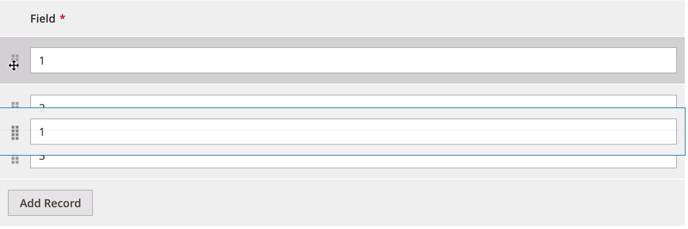

The DynamicRowsDragAndDrop component is an [extension](https://glossary.magento.com/extension) for [DynamicRows](dynamicrows.html), allowing users to change column position in the table.

## Configuration options

| Option | Description | Type | Default Value |
| --- | --- | --- | --- |
| `component` | The path to the component’s `.js` file in terms of RequireJS. | String | `'Magento_Ui/js/dynamic-rows/dnd'` |
| `draggableElement` | The dragged HTML element. | Object | `{}` |
| `draggableElementClass` | The class adds to the dragged element. | String | `'_dragged'` |
| `enabled` | Whether the component is allowed to change the position of columns. | Boolean | `true` |
| `name` | The name of the component in the [registry](concepts/registry.md). | Boolean | `'${ $.name }_dnd'` |
| `recordsCache` | The array of cached records. | Array | `[]` |
| `recordsProvider` | The path in the [registry](concepts/registry.md) to the linked records provider. | String | `'${ $.name }'` |
| `separatorsClass` | The object with class separators for top and bottom positions. | Object | `{top: '_dragover-top', bottom: '_dragover-bottom'}` |
| `tableClass` | The selector of the [DynamicRows](dynamicrows.html) table HTML element. | String | `table.admin__dynamic-rows` |
| `template` | Path to the component’s `.html` template. | String | `'ui/dynamic-rows/cells/dnd'` |

## Sources files

Extends [`UiElement`](concepts/element.md):

-  [app/code/Magento/Ui/view/base/web/js/dynamic-rows/dnd.js](https://github.com/magento/magento2/blob/2.4/app/code/Magento/Ui/view/base/web/js/dynamic-rows/dnd.js)
-  [app/code/Magento/Ui/view/base/web/templates/dynamic-rows/cells/dnd.html](https://github.com/magento/magento2/blob/2.4/app/code/Magento/Ui/view/base/web/templates/dynamic-rows/cells/dnd.html)

## Examples

### Integrate the DynamicRowsDragAndDrop component with the DynamicRows component

This is an example of how the DynamicRowsDragAndDrop component integrates with the [DynamicRows](dynamicrows.html) component:

```xml
<dynamicRows name="dynamic_rows">
    <settings>
        <addButtonLabel translate="true">Add Record</addButtonLabel>
        <dndConfig>
            <param name="enabled" xsi:type="boolean">true</param>
            <param name="draggableElementClass" xsi:type="string">_dragged</param>
            <param name="tableClass" xsi:type="string">table.admin__dynamic-rows</param>
        </dndConfig>
    </settings>
    <container name="record" component="Magento_Ui/js/dynamic-rows/record">
        <argument name="data" xsi:type="array">
            <item name="config" xsi:type="array">
                <item name="isTemplate" xsi:type="boolean">true</item>
                <item name="is_collection" xsi:type="boolean">true</item>
                <item name="componentType" xsi:type="string">container</item>
            </item>
        </argument>
        <field name="field" formElement="input">
            <argument name="data" xsi:type="array">
                <item name="config" xsi:type="array">
                    <item name="fit" xsi:type="boolean">false</item>
                </item>
            </argument>
            <settings>
                <validation>
                    <rule name="required-entry" xsi:type="boolean">true</rule>
                </validation>
                <dataType>text</dataType>
                <label>Field</label>
            </settings>
        </field>
    </container>
</dynamicRows>
```

#### Result



### Disable the DynamicRowsDragAndDrop component on the DynamicRows component

This is an example of how the DynamicRowsDragAndDrop component disables the [DynamicRows](dynamicrows.html) component:

```xml
<dynamicRows name="dynamic_rows">
    <settings>
        ...
        <dndConfig>
            <param name="enabled" xsi:type="boolean">false</param>
        </dndConfig>
    </settings>
    <container name="record" component="Magento_Ui/js/dynamic-rows/record">
        ...
    </container>
</dynamicRows>
```
