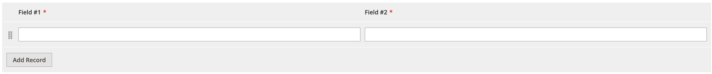

# DynamicRows component

The DynamicRows component is a dynamic collection of records. The user can edit the records, change their position, and navigate through the collection.

## Options

| Option | Description | Type | Default |
| --- | --- | --- | --- |
| `addButton` | Renders button for adding a new row. | Boolean | `-` |
| `addButtonLabel` | Label for the adding a new row button. | String | `'Add'` |
| `additionalClasses` | Sets custom classes to the component's DOM block. | Object | `{}` |
| `defaultRecord` | Renders the default (first) row when the component is initialized without data. | Boolean | `false` |
| `deleteProperty` | The property added to a record data object when the record is deleted. Applied if the `deleteValue` option is enabled. | String | `'delete'` |
| `dndConfig` | Configuration of the drag and drop (DND) plugin for dynamicRows. | Object | `{name: '${ $.name }_dnd', component: 'Magento_Ui/js/dynamic-rows/dnd', template: 'ui/dynamic-rows/cells/dnd', recordsProvider: '${ $.name }', enabled: true }` |
| `collapsibleHeader` | Enables or disables the collapsible functionality for the header (if columns header is enabled). | Boolean | `false` |
| `columnsHeader` | Hides or shows columns header. | Boolean | `true` |
| `columnsHeaderClasses` | Adds custom class to columns header (if the column header is enabled). | String | `''` |
| `component` | The path to the component’s JS constructor in terms of RequireJS. | String | `Magento_Ui/js/dynamic-rows/dynamic-rows` |
| `currentPage` | The number of current page. | Number | `1` |
| `deleteValue` |  Adds the `deleteProperty` property in the data object for the deleted record. | Boolean | `false` |
| `disabled` | Initial component's state. When set to `true`, users cannot take action on the element. | Boolean | `false` |
| `fallbackResetTpl` | The path to the fallback reset (restore to default button) `.html` template. | String | `ui/form/element/helper/fallback-reset-link` |
| `identificationProperty` | The identification property added to the record data object. | String | `record_id` |
| `pageSize` | The number of records on one page. | Number | `20` |
| `recordTemplate` | The path to the `.html` template of a records(row). The list of templates is declared in the `templates` property. | String | `record` |
| `template` | The path to the component’s `.html` template. | String | `ui/dynamic-rows/templates/default` |
| `visible` | Initial component's visibility. When set to `false`, the `display: none` CSS style is added to the component's DOM block. | Boolean | `true` |

## Source files

Extends [`UiCollection`](concepts/collection.md):

-  [`app/code/Magento/Ui/view/base/web/js/dynamic-rows/dynamic-rows.js`](https://github.com/magento/magento2/blob/2.4/app/code/Magento/Ui/view/base/web/js/dynamic-rows/dynamic-rows.js)
-  [`app/code/Magento/Ui/view/base/web/templates/dynamic-rows/templates/default.html`](https://github.com/magento/magento2/blob/2.4/app/code/Magento/Ui/view/base/web/templates/dynamic-rows/templates/default.html)

## Examples

### Integration

This is an example of how the DynamicRows component integrates with the [Form](form.html) component:

```xml
<form>
    ...
    <dynamicRows name="dynamic_rows">
        <settings>
            <addButtonLabel translate="true">Add Record</addButtonLabel>
            <additionalClasses>
                <class name="admin__field-wide">true</class>
            </additionalClasses>
            <componentType>dynamicRows</componentType>
        </settings>
        <container name="record" component="Magento_Ui/js/dynamic-rows/record">
            <argument name="data" xsi:type="array">
                <item name="config" xsi:type="array">
                    <item name="isTemplate" xsi:type="boolean">true</item>
                    <item name="is_collection" xsi:type="boolean">true</item>
                    <item name="componentType" xsi:type="string">container</item>
                </item>
            </argument>
            <field name="field_1" formElement="input">
                <argument name="data" xsi:type="array">
                    <item name="config" xsi:type="array">
                        <item name="fit" xsi:type="boolean">false</item>
                    </item>
                </argument>
                <settings>
                    <validation>
                        <rule name="required-entry" xsi:type="boolean">true</rule>
                    </validation>
                    <dataType>text</dataType>
                    <label>Field #1</label>
                </settings>
            </field>
            <field name="field_2" formElement="input">
                <argument name="data" xsi:type="array">
                    <item name="config" xsi:type="array">
                        <item name="fit" xsi:type="boolean">false</item>
                    </item>
                </argument>
                <settings>
                    <validation>
                        <rule name="required-entry" xsi:type="boolean">true</rule>
                    </validation>
                    <dataType>text</dataType>
                    <label>Field #2</label>
                </settings>
            </field>
        </container>
    </dynamicRows>
</form>
```

#### Result


