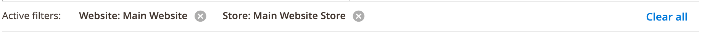

# FiltersChips component

The FiltersChips component provides UI controls that allows users to remove the previously-applied values of the [Filters](filters.html) and [Search](search.html) components.

## Options

| Option | Description | Type | Default Value |
| --- | --- | --- | --- |
| `component` | The path to the component’s `.js` file. | String | `Magento_Ui/js/grid/filters/chips` |
| `componentType` | The type of component. | String | `filtersChips` |
| `template` | Path to the component’s `.html` template. | String | `ui/grid/filters/chips` |

## Source files

Extends [`uiCollection`](concepts/collection.md):

-  [app/code/Magento/Ui/view/base/web/js/grid/filters/chips.js](https://github.com/magento/magento2/blob/2.4/app/code/Magento/Ui/view/base/web/js/grid/filters/chips.js)
-  [app/code/Magento/Ui/view/base/web/templates/grid/filters/chips.html](https://github.com/magento/magento2/blob/2.4/app/code/Magento/Ui/view/base/web/templates/grid/filters/chips.html)

## Examples

### Integration

This is an example of how the FiltersChips component integrates with the [Filters](filters.html) component:

```xml
<listing>
    <listingToolbar>
        <filters name="listing_filters">
            <settings>
                <chipsConfig>
                    <param name="component" xsi:type="string">Magento_Ui/js/grid/filters/chips</param>
                    <param name="componentType" xsi:type="string">filtersChips</param>
                    <param name="template" xsi:type="string">ui/grid/filters/chips</param>
                </chipsConfig>
            </settings>
        </filters>
    </listingToolbar>
</listing>
```

#### Result


