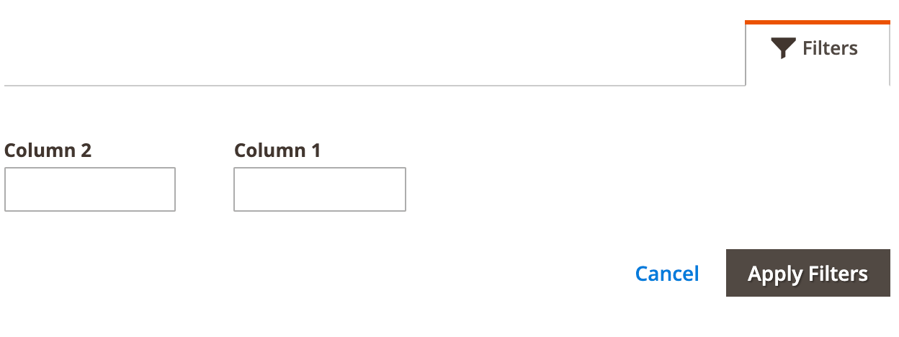

# Filters component

The Filters component renders UI controls for filtering and applies filtering. Must be a child of the [Listing component](listing-grid.md).

See the [Admin Design Pattern Library (Filters)](https://devdocs.magento.com/guides/v2.4/pattern-library/filters/data-table-filters/filtering.html) topic for information about the UI design patterns that can be implemented using Filters component.

## Options

| Option | Description | Type | Default Value |
| --- | --- | --- | --- |
| `component` | The path to the component’s `.js` file in terms of RequireJS. | String | `''` |
| `chipsConfig` | Configuration passed to the [`FiltersChips`](filters-chips.md) component. | Object | `{ name: '${ $.name }_chips', provider: '${ $.chipsConfig.name }', component: 'Magento_Ui/js/grid/filters/chips'}` |
| `statefull` |Defines a list of component properties whose values are automatically saved in the configured storage if they change. `key` is the property's name and the `value` defines whether its saved.  | Object | `{applied: true}` |
| `stickyTmpl` | Additional `.html` template that displays filters when the Toolbar component gets a fixed position. | String | `ui/grid/sticky/filters` |
| `template` | Path to the component’s `.html` template. | String | `ui/grid/filters/filters` |
| `templates.filters` |Describes basic filter types. This definitions are used to dynamically create filter elements based on the `filter` field specified in the corresponding column. For example, if a column's `filter` property contains the `text` value, then a `Filter` component instance with a definition for the `text` type will be created.  | Object | Contains definitions of the `text`, `select`,`dateRange` and `textRange` filter types. |

## Source files

Extends [`uiCollection`](concepts/collection.md):

-  [app/code/Magento/Ui/view/base/web/js/grid/filters/filters.js](https://github.com/magento/magento2/blob/2.4/app/code/Magento/Ui/view/base/web/js/grid/filters/filters.js)
-  [app/code/Magento/Ui/view/base/web/templates/grid/sticky/filters.html](https://github.com/magento/magento2/blob/2.4/app/code/Magento/Ui/view/base/web/templates/grid/sticky/filters.html)
-  [app/code/Magento/Ui/view/base/web/templates/grid/filters/filters.html](https://github.com/magento/magento2/blob/2.4/app/code/Magento/Ui/view/base/web/templates/grid/filters/filters.html)

## Examples

### Add a new filterable customer attribute

To add a new customer attribute to the customer grid and make it filterable, follow these steps:

1. Create `view/adminhtml/ui_component/customer_listing.xml` to add a column component.
1. Create the column component [PHP](https://glossary.magento.com/php) class which extends `Magento\Ui\Component\Listing\Columns\Column`.
1. Create `etc/indexer.xml` to add the attribute to the `customer_grid` index and define it as filterable.
1. Set `is_used_in_grid` to `true` for the attribute.

### Integration

This example integrates the Filters component with the [Listing](listing-grid.md) component:

```xml
<listing>
    ...
    <listingToolbar>
        <!-- integrates the Filters component -->
        <filters name="listing_filters" />
    </listingToolbar>
    <!-- add columns -->
    <columns name="columns_example">
        <column name="column1" sortOrder="10">
            <settings>
                <filter>text</filter>
                <dataType>text</dataType>
                <label translate="true">Column 1</label>
                <default>1</default>
            </settings>
        </column>
        <column name="column2" sortOrder="13">
            <settings>
                <filter>text</filter>
                <dataType>text</dataType>
                <label translate="true">Column 2</label>
                <default>2</default>
            </settings>
        </column>
    </columns>
</listing>
```

#### Result


