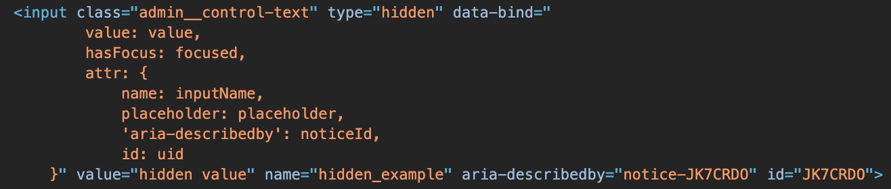

# Hidden component

The Hidden component is a form element that implements the [HTML](https://glossary.magento.com/html) `<input type="hidden">` field.

## Options

| Option | Description | Type | Default |
| --- | --- | --- | --- |
| `component` | The path to the component’s JS constructor in terms of RequireJS. | String | `Magento_Ui/js/form/element/abstract` |
| `template` | The path to the component’s `.html` template. | String | `ui/form/element/hidden` |

## Source files

Extends [`UiElement`](concepts/element.md):

-  [app/code/Magento/Ui/view/base/web/js/form/element/abstract.js](https://github.com/magento/magento2/blob/2.4/app/code/Magento/Ui/view/base/web/js/form/element/abstract.js)
-  [app/code/Magento/Ui/view/base/web/templates/form/element/hidden.html](https://github.com/magento/magento2/blob/2.4/app/code/Magento/Ui/view/base/web/templates/form/element/hidden.html)

## Examples

### Integration

This example integrates the Hidden component with the [Form](form.md) component.

```xml
<form>
    ...
    <fieldset>
        ...
        <hidden name="hidden_example">
            <settings>
                <value>hidden value</value>
            </settings>
        </hidden>
    </fieldset>
</form>
```

#### Result


