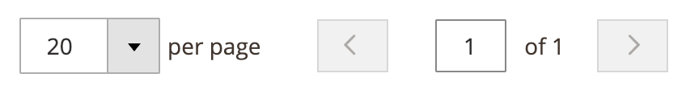
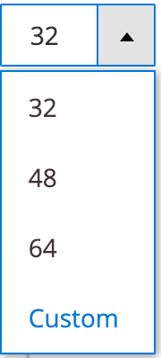

# Paging component

The Paging component implements pagination in grids implemented using [Listing](listing-grid.html). It also creates an instance of the child Sizes component which allows to define the number of records displayed in the associated table.

## Options

| Option | Description | Type | Default Value |
| --- | --- | --- | --- |
| `current` | The number of current page. | String | `1` |
| `sizesConfig`.`maxSize` | The maximum number of elements on a page configuration that is passed to the `Sizes` component. | Object | `999` |
| `sizesConfig`.`minSize` | The minimum number of elements on a page configuration that is passed to the `Sizes` component. | Object | `1` |
| `template` | The path to the component’s `.html` template. | String | `ui/grid/paging/paging` |
| `totalTmpl` | Path to the `.html` template for rendering the total amount of found records. | String | `ui/grid/paging-total` |

## Source files

Extends [`UiElement`](concepts/element.md):

-  [app/code/Magento/Ui/view/base/web/js/grid/paging/paging.js](https://github.com/magento/magento2/blob/2.4/app/code/Magento/Ui/view/base/web/js/grid/paging/paging.js)
-  [app/code/Magento/Ui/view/base/web/templates/grid/paging/paging.html](https://github.com/magento/magento2/blob/2.4/app/code/Magento/Ui/view/base/web/templates/grid/paging/paging.html)
-  [app/code/Magento/Ui/view/base/web/templates/grid/paging-total.html](https://github.com/magento/magento2/blob/2.4/app/code/Magento/Ui/view/base/web/templates/grid/paging-total.html)

## Examples

### Integration

This example integrates the Paging component with the [Listing](listing-grid.html) component:

```xml
<listing>
    ...
    <listingToolbar>
        ...
        <paging name="listing_paging"/>
    </listingToolbar>
</listing>
```

#### Result



### Configure page size and options

This example configures the Paging component with the page size and options:

```xml
<paging name="listing_paging">
    <settings>
        <options>
            <option name="32" xsi:type="array">
                <item name="value" xsi:type="number">32</item>
                <item name="label" xsi:type="string">32</item>
            </option>
            <option name="48" xsi:type="array">
                <item name="value" xsi:type="number">48</item>
                <item name="label" xsi:type="string">48</item>
            </option>
            <option name="64" xsi:type="array">
                <item name="value" xsi:type="number">64</item>
                <item name="label" xsi:type="string">64</item>
            </option>
        </options>
        <pageSize>32</pageSize>
    </settings>
</paging>
```

#### Result


