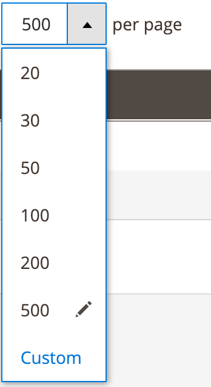

# Sizes component

The Sizes component defines the maximum number of displayed records in a table (grid).

## Options

| Option | Description | Type | Default Value |
| --- | --- | --- | --- |
| `component` | The path to the component’s `.js` file in terms of RequireJS. | String | `'Magento_Ui/js/grid/paging/sizes'` |
| `maxSize` | Maximum allowed number of rows. | Number | `999` |
| `minSize` | Minimum number of rows. | Number | `1` |
| `options` | The initial list of available table sizes (number of rows). | Array | `[]` |
| `template` | Path to the component’s `.html` template. | String | `ui/grid/paging/sizes` |
| `value` | Initial number of rows per page. | Number | `20` |

### SizeOption interface

| Option | Description | Type | Required |
| --- | --- | --- | --- |
| `label` | Label displayed in the rendered options list. This label is usually equal to the corresponding `value` property. | String \| Number | Required |
| `value` | Options identifier which represents the table size. | Number | Required |

## Source files

Extends [`UiElement`](concepts/element.md):

-  [app/code/Magento/Ui/view/base/web/js/grid/paging/sizes.js](https://github.com/magento/magento2/blob/2.4/app/code/Magento/Ui/view/base/web/js/grid/paging/sizes.js)
-  [app/code/Magento/Ui/view/base/web/templates/grid/paging/sizes.html](https://github.com/magento/magento2/blob/2.4/app/code/Magento/Ui/view/base/web/templates/grid/paging/sizes.html)

## Examples

### Integration

This example integrates the Sizes component with the [Paging](paging.html) component:

```xml
<listing>
    <listingToolbar>
        <paging name="listing_paging">
            <argument name="data" xsi:type="array">
                <item name="config" xsi:type="array">
                    <item name="sizesConfig" xsi:type="array">
                        <item name="component" xsi:type="string">Magento_Ui/js/grid/paging/sizes</item>
                        <item name="template" xsi:type="string">ui/grid/paging/sizes</item>
                        <item name="maxSize" xsi:type="number">500</item>
                    </item>
                </item>
            </argument>
        </paging>
    </listingToolbar>
</listing>
```

#### Result


