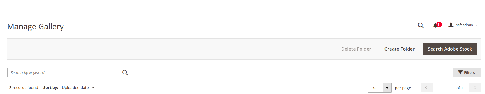

# Sortby component

The Sortby component allows you to sort the column in ascending or descending order.

## Options

|      Option                |   Description                                                                 |      Type      |  Default Value   |
|----------------------------|-------------------------------------------------------------------------------|----------------| -----------------|
| `template`                 | Path to the component .html template.                                         | String         | `ui/grid/sortBy` |
| `options`                  | List of options available for sorting.                                        | Array          | `[]`             |
| `applied`                  | Currently applied sorting.                                                    | Object         | `{}`             |
| `sorting`                  | Specify ascending (`asc`) or descending (`desc`) sorting order for the column.| String         | `asc`            |
| `selectedOption`           | Currently selected option for sorting.                                        | String         |  -               |
| `isVisible`                | Check if component is visible or not.                                         | Boolean        | `true`           |

## Examples

```xml
<listing>
    ...
    <container name="sorting"
               provider="dataProvider"
               displayArea="sorting"
               sortOrder="20"
               component="Magento_Ui/js/grid/sortBy">
               <argument name="data" xsi:type="array">
                   <item name="config" xsi:type="array">
                       <item name="deps" xsi:type="array">
                           <item name="0" xsi:type="string">
                               columnProvider
                           </item>
                       </item>
                   </item>
               </argument>
    </container>
    ...
    <columns name="columnProvider">
        <column name="name">
            <settings>
                <label translate="true">Name</label>
                <visible>false</visible>
                <sortable>true</sortable>
            </settings>
        </column>
        <column name="directory">
            <settings>
                <label translate="true">Directory</label>
                <visible>false</visible>
                <sortable>true</sortable>
            </settings>
        </column>
    </columns>
</listing>

```

## Source files

Extends [`UiElement`](concepts/element.md):

*  [app\code\Magento\Ui\view\base\web\js\grid\sortBy.js](https://github.com/magento/magento2/blob/2.4/app/code/Magento/Ui/view/base/web/js/grid/sortBy.js)
*  [app\code\Magento\Ui\view\base\web\templates\grid\sortBy.html](https://github.com/magento/magento2/blob/2.4/app/code/Magento/Ui/view/base/web/templates/grid/sortBy.html)

## Result


