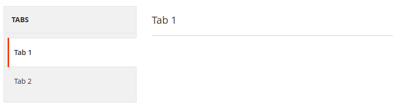

# Tab component

The Tab component implements a tab content area.

See the [Admin Design Pattern Library (Tabs)](https://devdocs.magento.com/guides/v2.4/pattern-library/containers/tabs/tabs.html) topic for information about the UI design patterns that can be implemented using the Tab component.

## Options

<table>
  <tr>
    <th>Option </th>
    <th>Description</th>
    <th>Type</th>
    <th>Default</th>
  </tr>
  <tr>
    <td><code>component</code></td>
    <td>The path to the component’s JS constructor, in terms of RequireJS.</td>
    <td>String</td>
    <td><code>Magento_Ui/js/form/components/area</code></td>
  </tr>
  <tr>
    <td><code>template</code></td>
    <td>The path to the component’s <code>.html</code> template.</td>
    <td>String</td>
    <td><code>templates/layout/tabs/tab/default</code></td>
  </tr>
  <tr>
    <td><code>uniqueNs</code></td>
    <td>Unique namespace for the component.</td>
    <td>String</td>
    <td><code>params.activeArea</code></td>
  </tr>
</table>

## Examples

### Integration

This example integrates the Tab component with the [Form](form.html) component.

```xml
<form>
    ...
    <argument name="data" xsi:type="array">
        ...
        <item name="label" xsi:type="string" translate="true">Tabs</item>
    </argument>
    <settings>
        ...
        <layout>
            <navContainerName>left</navContainerName>
            <type>tabs</type>
        </layout>
    </settings>
    <fieldset name="tab1">
        <settings>
            ...
            <label translate="true">Tab 1</label>
        </settings>
        ...
    </fieldset>
    <fieldset name="tab2">
        <settings>
            ...
            <label translate="true">Tab 2</label>
        </settings>
        ...
    </fieldset>
</form>
```

#### Results


