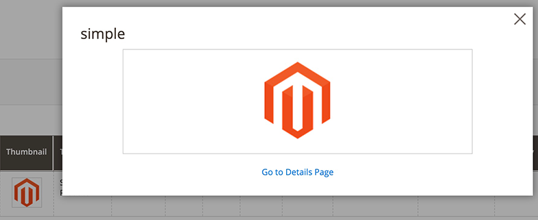

# ThumbnailColumn component

The ThumbnailColumn component implements a column containing images associated with records of the table. Each field of this column contains an image preview. When a user click on the preview, a pop up window with the detailed view opens.

## Configuration options

| Option       | Description    | Type | Default |
| ------------ | -------------- | ---- | ------- |
| `bodyTmpl`   | Path to the template used for rendering a column's fields in the table body. | `String` | `ui/grid/cells/thumbnail` |
| `fieldClass` | Additional CSS classes appended to the column's field elements. | `{[name: string]: boolean}` | `{'data-grid-thumbnail-cell': true}` |

## Examples

### Integrate the ThumbnailColumn component with the Listing component

This sample shows how the thumbnail column is added into the Product [Listing](listing-grid.html) component:

```xml
<columns>
    <column name="thumbnail" component="Magento_Ui/js/grid/columns/thumbnail" class="Magento\Catalog\Ui\Component\Listing\Columns\Thumbnail">
        <settings>
            <hasPreview>1</hasPreview>
            <addField>true</addField>
            <label translate="true">Thumbnail</label>
            <sortable>false</sortable>
        </settings>
    </column>
</columns>
```

#### Result



## Source files

-  [Magento/Catalog/Ui/Component/Listing/Columns/Thumbnail](https://github.com/magento/magento2/blob/2.4/app/code/Magento/Catalog/Ui/Component/Listing/Columns/Thumbnail.php)

Extends [`Column`](column.html):

-  [app/code/Magento/Ui/view/base/web/js/grid/columns/thumbnail.js](https://github.com/magento/magento2/blob/2.4/app/code/Magento/Ui/view/base/web/js/grid/columns/thumbnail.js)
