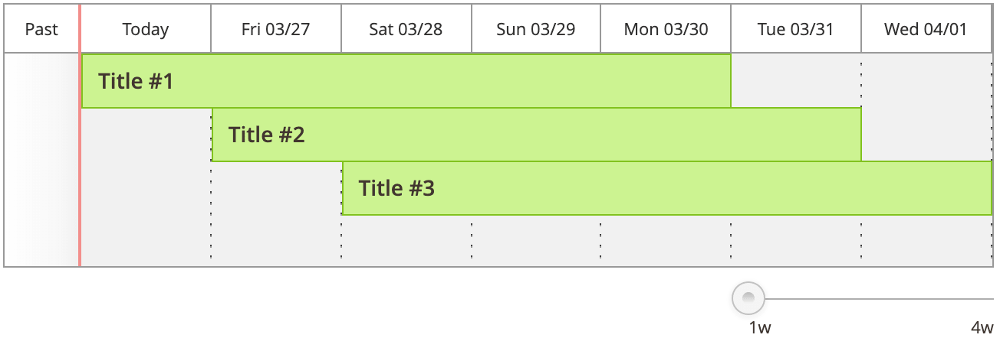

# TimelineColumn component

The TimelineColumns [UI component](https://glossary.magento.com/ui-component) is a collection of columns represented as the timeline.

## Configuration options

| Option | Description | Type | Default |
| --- | --- | --- | --- |
| `component` | The path to the component's `.js` file, relative to RequireJS. | String | `'Magento_Ui/js/timeline/timeline'` |
| `recordTmpl` | The path to the `.html` template of the listing (grid) record. | String | `'ui/timeline/record'` |
| `dateFormat` | Date format for start_time and end_time columns. | String | `'YYYY-MM-DD HH:mm:ss'` |
| `headerFormat` | Date format for the displayed column headers. | String | `'ddd MM/DD'` |
| `scale` | The scale of the grid range in days. | Number | `7` |
| `scaleStep` | The scaling step in days. | Number | `1` |
| `minScale` | The minimal scale in days. | Number | `7` |
| `maxScale` | The maximum scale in days. | Number | `28` |
| `displayMode` | Initial display mode. | String | `'timeline'` |
| `displayModes` | List of available display modes. | Object | `{timeline: {label: 'Timeline',value: 'timeline',template: 'ui/timeline/timeline'}}` |
| `viewConfig` | Configurations for the [TimelineView](https://github.com/magento/magento2/blob/2.4/app/code/Magento/Ui/view/base/web/js/timeline/timeline-view.js) component. | Object | `{timeline: {label: 'Timeline',value: 'timeline',template: 'ui/timeline/timeline'}}` |

## Sources files

Extends [`Columns`](columns.md):

-  [app/code/Magento/Ui/view/base/web/js/timeline/timeline.js](https://github.com/magento/magento2/blob/2.4/app/code/Magento/Ui/view/base/web/js/timeline/timeline.js)
-  [app/code/Magento/Ui/view/base/web/templates/timeline/timeline.html](https://github.com/magento/magento2/blob/2.4/app/code/Magento/Ui/view/base/web/templates/timeline/timeline.html)

## Examples

### Integrate the TimelineColumns component with the Listing component

```xml
<listing>
    <columns name="cms_page_columns" component="Magento_Ui/js/timeline/timeline">
        <argument name="data" xsi:type="array">
            <item name="config" xsi:type="array">
                <item name="scale" xsi:type="number">7</item>
            </item>
        </argument>
        <column name="name">
            <settings>
                <filter>text</filter>
                <label translate="true">Name</label>
            </settings>
        </column>
        <column name="start_time" class="Magento\Ui\Component\Listing\Columns\Date" component="Magento_Ui/js/grid/columns/date">
            <settings>
                <dateFormat>YYYY-MM-DD HH:mm:ss</dateFormat>
                <label translate="true">Start Time</label>
            </settings>
        </column>
        <column name="end_time" class="Magento\Ui\Component\Listing\Columns\Date" component="Magento_Ui/js/grid/columns/date">
            <settings>
                <dateFormat>YYYY-MM-DD HH:mm:ss</dateFormat>
                <label translate="true">End Time</label>
            </settings>
        </column>
    </columns>
</listing>
```

#### Result


