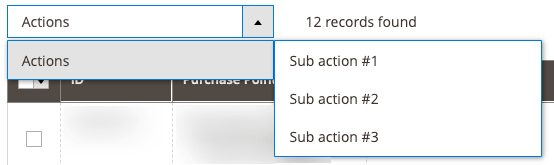

# TreeMassActions component

The TreeMassActions component is a decorator for [MassActions](mass-actions.md) that adds the support of nested actions.

## Options

| Option | Description | Type | Default |
| --- | --- | --- | --- |
| `submenuTemplate` | Path to the `.html` template used to render nested actions. | String | `ui/grid/submenu` |
| `template` | Path to the component’s `.html` template. | String | `ui/grid/tree-massactions` |
| `actions` | A list of available actions. | (MassActionContainer \| MassAction)[] | - |

### MassActionContainer interface

| Option | Description | Type | Required |
| --- | --- | --- | --- |
| `label` | Action's label displayed in the list of actions. | String | Required |
| `type` | Action's identifier. | String | Required |
| `actions` | A list of child elements that may contain both MassActionContainer and MassAction instances. | (MassActionContainer \| MassAction)[] | Required |

## Source files

Extends [`MassActions`](mass-actions.md):

-  [app/code/Magento/Ui/view/base/web/js/grid/tree-massactions.js](https://github.com/magento/magento2/blob/2.4/app/code/Magento/Ui/view/base/web/js/grid/tree-massactions.js)
-  [app/code/Magento/Ui/view/base/web/templates/grid/tree-massactions.html](https://github.com/magento/magento2/blob/2.4/app/code/Magento/Ui/view/base/web/templates/grid/tree-massactions.html)

## Example

```xml
<listing>
    ...
    <listingToolbar>
        ...
        <massaction name="listing_massaction" component="Magento_Ui/js/grid/tree-massactions">
            <action name="action_example">
                <argument name="data" xsi:type="array">
                    <item name="config" xsi:type="array">
                        <item name="type" xsi:type="string">action</item>
                        <item name="label" xsi:type="string" translate="true">Actions</item>
                    </item>
                </argument>
                <argument name="actions" xsi:type="array">
                    <item name="0" xsi:type="array">
                        <item name="type" xsi:type="string">sub_action1</item>
                        <item name="label" xsi:type="string" translate="true">Sub action #1</item>
                        <item name="url" xsi:type="url" path="some/path">
                            <param name="some_param">1</param>
                        </item>
                    </item>
                    <item name="1" xsi:type="array">
                        <item name="type" xsi:type="string">sub_action2</item>
                        <item name="label" xsi:type="string" translate="true">Sub action #2</item>
                        <item name="url" xsi:type="url" path="some/path">
                            <param name="some_param">2</param>
                        </item>
                    </item>
                    <item name="2" xsi:type="array">
                        <item name="type" xsi:type="string">sub_action3</item>
                        <item name="label" xsi:type="string" translate="true">Sub action #3</item>
                        <item name="url" xsi:type="url" path="some/path">
                            <param name="some_param">3</param>
                        </item>
                    </item>
                </argument>
            </action>
        </massaction>
        ...
    </listingToolbar>
    ...
</listing>
```

## Result


